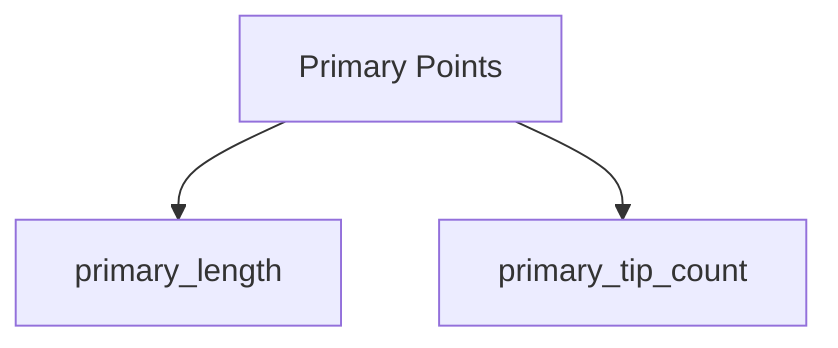

# Create New Pipeline

Scaffold a new trait pipeline class with all the boilerplate code, tests, and documentation.

## Quick Start

```bash
# Interactive pipeline creation
```

This will ask you questions and generate:
1. Pipeline class in `sleap_roots/trait_pipelines.py`
2. Test file `tests/test_<pipeline_name>.py`
3. Update `sleap_roots/__init__.py` exports
4. Template docstrings and trait definitions

## What Gets Generated

### 1. Pipeline Class

Creates a new pipeline class in `sleap_roots/trait_pipelines.py`:

```python
class MyNewPipeline(Pipeline):
    \"\"\"Pipeline for analyzing [description].

    This pipeline computes traits for [plant type] with [root types].

    Attributes:
        series: Series object containing predictions and data.

    Methods:
        get_trait_definitions: Define all traits computed by this pipeline.
        compute_traits: Compute all traits for a given frame.
    \"\"\"

    def get_trait_definitions(self) -> list[TraitDef]:
        \"\"\"Define traits computed by this pipeline.

        Returns:
            List of TraitDef objects specifying all computed traits.
        \"\"\"
        return [
            # TODO: Add trait definitions
        ]

    def compute_traits(
        self, series: "Series", frame_index: int
    ) -> dict[str, Any]:
        \"\"\"Compute all traits for the specified frame.

        Args:
            series: Series object with predictions.
            frame_index: Index of frame to analyze.

        Returns:
            Dictionary mapping trait names to computed values.
        \"\"\"
        # TODO: Implement trait computation
        pass
```

### 2. Test File

Creates `tests/test_my_new_pipeline.py`:

```python
\"\"\"Tests for MyNewPipeline.\"\"\"

import pytest
import numpy as np
from sleap_roots import MyNewPipeline, Series


class TestMyNewPipeline:
    \"\"\"Test suite for MyNewPipeline.\"\"\"

    def test_instantiation(self):
        \"\"\"Test pipeline can be instantiated.\"\"\"
        pipeline = MyNewPipeline()
        assert pipeline is not None

    def test_get_trait_definitions(self):
        \"\"\"Test trait definitions are properly formatted.\"\"\"
        pipeline = MyNewPipeline()
        traits = pipeline.get_trait_definitions()

        assert len(traits) > 0
        for trait in traits:
            assert hasattr(trait, 'name')
            assert hasattr(trait, 'compute_fn')

    def test_compute_traits(self):
        \"\"\"Test trait computation on real data.\"\"\"
        # TODO: Load test series
        # series = Series.load(...)
        # pipeline = MyNewPipeline()
        # traits = pipeline.compute_traits(series, frame_index=0)
        # assert 'trait_name' in traits
        pass
```

### 3. Export Update

Updates `sleap_roots/__init__.py`:

```python
from sleap_roots.trait_pipelines import (
    DicotPipeline,
    YoungerMonocotPipeline,
    # ... existing pipelines
    MyNewPipeline,  # Added
)
```

## Interactive Prompts

When you run the command, you'll answer:

### 1. Pipeline Name
```
Pipeline name (PascalCase): MyNewPipeline
```

### 2. Description
```
Brief description: Pipeline for analyzing dicot plants with multiple primary roots
```

### 3. Root Types
```
Which root types does this pipeline use?
[x] Primary roots
[x] Lateral roots
[ ] Crown roots
```

### 4. Plant Type
```
Plant type:
[x] Dicot
[ ] Monocot
[ ] Both
```

### 5. Test Data
```
Which test dataset should be used for tests?
[ ] tests/data/canola_7do
[x] tests/data/soy_6do
[ ] tests/data/rice_3do
[ ] tests/data/rice_10do
[ ] Custom path
```

## Generated Files Summary

```
✅ Created MyNewPipeline class in sleap_roots/trait_pipelines.py
✅ Created test file tests/test_my_new_pipeline.py
✅ Updated sleap_roots/__init__.py exports
✅ Generated trait definition template

Next steps:
1. Implement get_trait_definitions() - define your traits
2. Implement compute_traits() - compute trait values
3. Add trait computation tests
4. Run tests: pytest tests/test_my_new_pipeline.py
5. Update documentation
```

## What You Need to Implement

### Step 1: Define Traits

In `get_trait_definitions()`:

```python
def get_trait_definitions(self) -> list[TraitDef]:
    return [
        TraitDef(
            name="my_trait_name",
            description="Description of what this trait measures",
            compute_fn=lambda series, frame_idx: self._compute_my_trait(
                series, frame_idx
            ),
        ),
        # Add more traits...
    ]
```

### Step 2: Implement Trait Computations

```python
def _compute_my_trait(self, series: "Series", frame_index: int) -> float:
    \"\"\"Compute my custom trait.

    Args:
        series: Series with predictions.
        frame_index: Frame to analyze.

    Returns:
        Computed trait value.
    \"\"\"
    # Get points for this frame
    pts = series.get_primary_points(frame_index)

    # Compute trait
    # ... your logic here

    return trait_value
```

### Step 3: Add Tests

```python
def test_my_trait_computation(self):
    \"\"\"Test my_trait is computed correctly.\"\"\"
    series = Series.load(
        series_name="test",
        primary_path="tests/data/soy_6do/6PR6AA22JK.primary.slp",
    )

    pipeline = MyNewPipeline()
    traits = pipeline.compute_traits(series, frame_index=0)

    assert 'my_trait_name' in traits
    assert isinstance(traits['my_trait_name'], float)
    assert traits['my_trait_name'] > 0  # Or appropriate validation
```

## Example: Creating a Custom Pipeline

### User Input

```
Pipeline name: SimplePrimaryPipeline
Description: Minimal pipeline for primary root length only
Root types: [x] Primary
Plant type: [x] Both
Test data: tests/data/canola_7do
```

### Generated Code

```python
class SimplePrimaryPipeline(Pipeline):
    \"\"\"Minimal pipeline for primary root length only.

    Computes only the primary root length for any plant type.
    \"\"\"

    def get_trait_definitions(self) -> list[TraitDef]:
        return [
            TraitDef(
                name="primary_length",
                description="Length of primary root",
                compute_fn=lambda s, f: self._compute_length(s, f),
            ),
        ]

    def _compute_length(self, series: "Series", frame_index: int) -> float:
        \"\"\"Compute primary root length.\"\"\"
        pts = series.get_primary_points(frame_index)
        from sleap_roots.lengths import get_root_lengths
        return get_root_lengths(pts)

    def compute_traits(self, series: "Series", frame_index: int) -> dict:
        \"\"\"Compute traits for frame.\"\"\"
        return {
            "primary_length": self._compute_length(series, frame_index),
        }
```

## Advanced Options

### Generate with Existing Traits

```
Copy traits from existing pipeline? [y/N]: y
Pipeline to copy from:
[ ] DicotPipeline
[x] PrimaryRootPipeline
[ ] Custom

Selected traits to include:
[x] primary_length
[x] primary_tip_count
[ ] lateral_length_total
```

This pre-populates trait definitions from an existing pipeline.

### Add Mermaid Dependency Graph

```
Generate trait dependency graph? [y/N]: y
```

Adds a commented Mermaid graph template:

```python
\"\"\"
Trait dependency graph:


\"\"\"
```

## Validation

After generation, the command runs:

```bash
# 1. Syntax check
python -m py_compile sleap_roots/trait_pipelines.py

# 2. Import check
python -c "from sleap_roots import MyNewPipeline"

# 3. Instantiation check
python -c "from sleap_roots import MyNewPipeline; p = MyNewPipeline()"
```

If any check fails, you'll see an error with the issue.

## Common Patterns

### Pattern 1: Extend Existing Pipeline

```python
class MyNewPipeline(DicotPipeline):
    \"\"\"Extended DicotPipeline with additional traits.\"\"\"

    def get_trait_definitions(self) -> list[TraitDef]:
        # Get parent traits
        base_traits = super().get_trait_definitions()

        # Add new traits
        new_traits = [
            TraitDef(
                name="my_custom_trait",
                description="Custom measurement",
                compute_fn=lambda s, f: self._compute_custom(s, f),
            ),
        ]

        return base_traits + new_traits
```

### Pattern 2: Minimal Pipeline

```python
class MinimalPipeline(Pipeline):
    \"\"\"Compute only essential traits.\"\"\"

    def get_trait_definitions(self) -> list[TraitDef]:
        return [
            TraitDef("length", "", lambda s, f: get_root_lengths(...)),
            TraitDef("tip_count", "", lambda s, f: get_tip_count(...)),
        ]

    def compute_traits(self, series, frame_index):
        return {t.name: t.compute_fn(series, frame_index)
                for t in self.get_trait_definitions()}
```

### Pattern 3: Multi-Root Pipeline

```python
class MultiRootPipeline(Pipeline):
    \"\"\"Analyze multiple root types.\"\"\"

    def _get_all_roots(self, series, frame_index):
        return {
            'primary': series.get_primary_points(frame_index),
            'lateral': series.get_lateral_points(frame_index),
            'crown': series.get_crown_points(frame_index),
        }

    def compute_traits(self, series, frame_index):
        roots = self._get_all_roots(series, frame_index)
        # Compute traits for each root type
        ...
```

## Tips

1. **Start simple**: Create minimal pipeline, then add traits incrementally
2. **Reuse existing functions**: Import from `sleap_roots.lengths`, `sleap_roots.angles`, etc.
3. **Test frequently**: Run tests after adding each new trait
4. **Document thoroughly**: Good docstrings make the pipeline usable
5. **Follow conventions**: Name traits like existing ones (snake_case, descriptive)
6. **Check existing pipelines**: Look at `DicotPipeline` for patterns

## Troubleshooting

### "Pipeline name already exists"

Choose a different name or use a suffix like `V2`, `Alt`, etc.

### "Import errors after generation"

Run validation:
```bash
python -c "from sleap_roots import MyNewPipeline"
```

Check for syntax errors in generated code.

### "Tests fail immediately"

Implement the trait computation methods before running tests. The generated tests are templates that need your implementation.

## Related Commands

- `/test` - Run your new pipeline tests
- `/coverage` - Check test coverage for new pipeline
- `/lint` - Ensure generated code follows style guidelines
- `/doc-traits` - Generate documentation for pipeline traits

## Next Steps After Generation

1. **Implement trait computation**
   ```python
   def _compute_my_trait(self, series, frame_idx):
       # Your logic here
       return value
   ```

2. **Add tests**
   ```python
   def test_my_trait_realistic_data(self):
       # Test on actual data
       pass
   ```

3. **Run tests**
   ```bash
   pytest tests/test_my_new_pipeline.py -v
   ```

4. **Check coverage**
   ```bash
   pytest --cov=sleap_roots.trait_pipelines tests/test_my_new_pipeline.py
   ```

5. **Update documentation**
   - Add pipeline to README.md
   - Document trait meanings
   - Add usage example

6. **Create PR**
   ```bash
   git add sleap_roots/trait_pipelines.py tests/test_my_new_pipeline.py
   git commit -m "feat: add MyNewPipeline"
   /pr-description
   ```