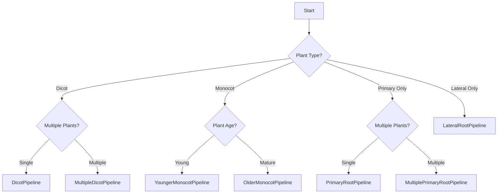

# Pipelines

## Overview

Pipeline classes provide pre-configured workflows for extracting traits from SLEAP root predictions. Each pipeline is optimized for specific plant types and root architectures, combining multiple trait computation functions into a single `fit_series()` call.

**Key features**:
- Pre-built trait computation workflows
- Optimized for different plant types (dicots, monocots)
- Automatic handling of multiple root types
- JSON/CSV export capabilities
- Consistent API across all pipelines

**When to use pipelines**:
- You want a complete set of traits without manual computation
- You're analyzing a specific plant type (dicot, monocot, etc.)
- You need standardized, reproducible trait extraction
- You want easy export to CSV/JSON for downstream analysis

## Which Pipeline Should I Use?



**Quick Decision Guide**:

| Plant Type | Root System | Pipeline |
|------------|-------------|----------|
| Dicot (single plant) | Primary + Lateral | [DicotPipeline](#dicotpipeline) |
| Dicot (multiple plants) | Primary + Lateral | [MultipleDicotPipeline](#multipledicotpipeline) |
| Monocot (young) | Crown roots | [YoungerMonocotPipeline](#youngermonocotpipeline) |
| Monocot (mature) | Crown roots | [OlderMonocotPipeline](#oldermonocotpipeline) |
| Any (single plant) | Primary only | [PrimaryRootPipeline](#primaryrootpipeline) |
| Any (multiple plants) | Primary only | [MultiplePrimaryRootPipeline](#multipleprimaryrootpipeline) |
| Any | Lateral only | [LateralRootPipeline](#lateralrootpipeline) |

## Quick Example

```python
import sleap_roots as sr

# Load plant data
series = sr.Series.load(
    "arabidopsis_1",
    h5_path="data.h5",
    primary_path="primary.slp",
    lateral_path="lateral.slp"
)

# Run pipeline
pipeline = sr.DicotPipeline()
traits = pipeline.fit_series(series)

# Access traits
print(f"Primary root length: {traits['primary_length']}")
print(f"Lateral root count: {traits['lateral_count']}")

# Export to CSV
import pandas as pd
df = pd.DataFrame([traits])
df.to_csv("traits.csv", index=False)
```

---

## DicotPipeline

::: sleap_roots.DicotPipeline
    options:
      show_source: true
      members:
        - __init__
        - fit_series
      heading_level: 3

### Overview

For analyzing dicot plants with both primary and lateral roots (e.g., Arabidopsis, canola, soybean).

**Root System**: Primary root + Lateral roots
**Plant Count**: Single plant per series
**Use Case**: Most common dicot analysis workflow

### Computed Traits

**Primary Root Traits**:
- `primary_length` - Total primary root length
- `primary_angle` - Angle relative to gravity
- `primary_tip_x`, `primary_tip_y` - Tip coordinates

**Lateral Root Traits**:
- `lateral_count` - Number of lateral roots
- `lateral_lengths` - Individual lateral root lengths
- `lateral_angles` - Individual lateral root angles
- `lateral_base_xs`, `lateral_base_ys` - Base point coordinates
- `lateral_tip_xs`, `lateral_tip_ys` - Tip point coordinates
- `base_length` - Length of lateral root zone on primary
- `base_ct_density` - Lateral root density

**Network Traits**:
- `network_length` - Total root system length
- `network_width_depth_ratio` - W:D ratio
- `network_distribution` - Root distribution metrics
- `network_solidity` - Compactness measure
- `convhull_area`, `convhull_perimeter` - Convex hull features

### Example

```python
import sleap_roots as sr

# Load dicot plant
series = sr.Series.load(
    "arabidopsis_1",
    h5_path="data.h5",
    primary_path="primary.slp",
    lateral_path="lateral.slp"
)

# Run pipeline
pipeline = sr.DicotPipeline()
traits = pipeline.fit_series(series)

# Access specific traits
print(f"Primary length: {traits['primary_length']:.2f} px")
print(f"Lateral count: {traits['lateral_count']}")
print(f"Total network length: {traits['network_length']:.2f} px")
print(f"W:D ratio: {traits['network_width_depth_ratio']:.2f}")

# Export
import json
with open("traits.json", "w") as f:
    json.dump(traits, f, indent=2, cls=sr.NumpyArrayEncoder)
```

**See Also**:

- [Tutorial: DicotPipeline](../../tutorials/dicot-pipeline.md)
- [MultipleDicotPipeline](#multipledicotpipeline) - For multiple plants

---

## MultipleDicotPipeline

::: sleap_roots.MultipleDicotPipeline
    options:
      show_source: true
      members:
        - __init__
        - fit_series
      heading_level: 3

### Overview

For analyzing multiple dicot plants in the same field of view.

**Root System**: Primary root + Lateral roots (per plant)
**Plant Count**: Multiple plants per series
**Use Case**: High-throughput screening, population studies

### Computed Traits

Same as [DicotPipeline](#dicotpipeline) but computed **per plant**:
- Traits are arrays where each element = one plant
- Allows comparison between plants in same image
- Handles varying numbers of lateral roots per plant

### Example

```python
import sleap_roots as sr

# Load multiple dicot plants
series = sr.Series.load(
    "canola_multipl e",
    h5_path="data.h5",
    primary_path="primary.slp",
    lateral_path="lateral.slp"
)

# Run pipeline
pipeline = sr.MultipleDicotPipeline()
traits = pipeline.fit_series(series)

# Traits are arrays (one value per plant)
import numpy as np
print(f"Number of plants: {len(traits['primary_length'])}")
print(f"Mean primary length: {np.nanmean(traits['primary_length']):.2f} px")
print(f"Lateral counts per plant: {traits['lateral_count']}")

# Per-plant analysis
for i, length in enumerate(traits['primary_length']):
    lat_count = traits['lateral_count'][i]
    print(f"Plant {i}: primary={length:.1f}px, laterals={lat_count}")
```

**See Also**:

- [Tutorial: Multiple Dicot Pipeline](../../tutorials/multiple-dicot-pipeline.md)
- [DicotPipeline](#dicotpipeline) - For single plants

---

## YoungerMonocotPipeline

::: sleap_roots.YoungerMonocotPipeline
    options:
      show_source: true
      members:
        - __init__
        - fit_series
      heading_level: 3

### Overview

For analyzing young monocot plants with emerging crown root systems (e.g., rice, wheat, maize at early stages).

**Root System**: Crown roots
**Plant Count**: Single plant per series
**Use Case**: Early-stage monocot seedlings

### Computed Traits

**Crown Root Traits** (per root):
- `crown_lengths` - Individual crown root lengths
- `crown_angles` - Individual crown root angles
- `crown_tip_xs`, `crown_tip_ys` - Tip coordinates

**Network Traits**:
- `network_length` - Total crown root length
- `network_width_depth_ratio` - W:D ratio
- `network_distribution` - Root distribution
- `convhull_area`, `convhull_perimeter` - Spatial metrics

### Example

```python
import sleap_roots as sr

# Load young monocot
series = sr.Series.load(
    "rice_seedling",
    h5_path="data.h5",
    crown_path="crown.slp"
)

# Run pipeline
pipeline = sr.YoungerMonocotPipeline()
traits = pipeline.fit_series(series)

# Analyze crown roots
import numpy as np
crown_lengths = traits['crown_lengths']
print(f"Number of crown roots: {len(crown_lengths)}")
print(f"Mean crown root length: {np.nanmean(crown_lengths):.2f} px")
print(f"Crown root angles: {traits['crown_angles']}")
```

**See Also**:

- [Tutorial: Younger Monocot Pipeline](../../tutorials/younger-monocot-pipeline.md)
- [OlderMonocotPipeline](#oldermonocotpipeline) - For mature plants

---

## OlderMonocotPipeline

::: sleap_roots.OlderMonocotPipeline
    options:
      show_source: true
      members:
        - __init__
        - fit_series
      heading_level: 3

### Overview

For analyzing mature monocot plants with established crown root systems.

**Root System**: Crown roots (mature)
**Plant Count**: Single plant per series
**Use Case**: Later-stage monocot plants with complex root architecture

### Computed Traits

Similar to [YoungerMonocotPipeline](#youngermonocotpipeline) with additional metrics for mature root systems:
- More robust network analysis
- Additional spatial distribution metrics
- Optimized for denser root systems

### Example

```python
import sleap_roots as sr

# Load mature monocot
series = sr.Series.load(
    "wheat_mature",
    h5_path="data.h5",
    crown_path="crown.slp"
)

# Run pipeline
pipeline = sr.OlderMonocotPipeline()
traits = pipeline.fit_series(series)

# Analyze mature root system
print(f"Network length: {traits['network_length']:.2f} px")
print(f"W:D ratio: {traits['network_width_depth_ratio']:.2f}")
print(f"Root system solidity: {traits['network_solidity']:.3f}")
```

**See Also**:

- [Tutorial: Older Monocot Pipeline](../../tutorials/older-monocot-pipeline.md)
- [YoungerMonocotPipeline](#youngermonocotpipeline) - For seedlings

---

## PrimaryRootPipeline

::: sleap_roots.PrimaryRootPipeline
    options:
      show_source: true
      members:
        - __init__
        - fit_series
      heading_level: 3

### Overview

For analyzing plants with only primary root (no laterals tracked).

**Root System**: Primary root only
**Plant Count**: Single plant per series
**Use Case**: Primary root-focused analysis, plants before lateral emergence

### Computed Traits

**Primary Root Traits**:
- `primary_length` - Total primary root length
- `primary_angle` - Gravitropic angle
- `primary_tip_x`, `primary_tip_y` - Tip position
- `curve_index` - Root curvature measure

### Example

```python
import sleap_roots as sr

# Load plant with primary root only
series = sr.Series.load(
    "early_seedling",
    h5_path="data.h5",
    primary_path="primary.slp"
)

# Run pipeline
pipeline = sr.PrimaryRootPipeline()
traits = pipeline.fit_series(series)

# Analyze primary root
print(f"Primary length: {traits['primary_length']:.2f} px")
print(f"Gravitropic angle: {traits['primary_angle']:.1f}°")
print(f"Curvature index: {traits['curve_index']:.3f}")
```

**See Also**:

- [Tutorial: Primary Root Pipeline](../../tutorials/primary-root-pipeline.md)
- [MultiplePrimaryRootPipeline](#multipleprimaryrootpipeline) - For multiple plants

---

## MultiplePrimaryRootPipeline

::: sleap_roots.MultiplePrimaryRootPipeline
    options:
      show_source: true
      members:
        - __init__
        - fit_series
      heading_level: 3

### Overview

For analyzing multiple plants, each with a primary root.

**Root System**: Primary roots (one per plant)
**Plant Count**: Multiple plants per series
**Use Case**: High-throughput primary root phenotyping

### Computed Traits

Same as [PrimaryRootPipeline](#primaryrootpipeline) but as **arrays** (one value per plant).

### Example

```python
import sleap_roots as sr

# Load multiple plants
series = sr.Series.load(
    "primary_array",
    h5_path="data.h5",
    primary_path="primary.slp"
)

# Run pipeline
pipeline = sr.MultiplePrimaryRootPipeline()
traits = pipeline.fit_series(series)

# Per-plant analysis
import numpy as np
n_plants = len(traits['primary_length'])
print(f"Analyzed {n_plants} plants")
print(f"Mean length: {np.nanmean(traits['primary_length']):.2f} px")
print(f"Mean angle: {np.nanmean(traits['primary_angle']):.1f}°")

# Compare plants
for i in range(n_plants):
    print(f"Plant {i}: {traits['primary_length'][i]:.1f} px, {traits['primary_angle'][i]:.1f}°")
```

**See Also**:

- [Tutorial: Multiple Primary Root Pipeline](../../tutorials/multiple-primary-root-pipeline.md)
- [PrimaryRootPipeline](#primaryrootpipeline) - For single plants

---

## LateralRootPipeline

::: sleap_roots.LateralRootPipeline
    options:
      show_source: true
      members:
        - __init__
        - fit_series
      heading_level: 3

### Overview

For analyzing lateral roots independently (without primary root context).

**Root System**: Lateral roots only
**Plant Count**: Single plant per series
**Use Case**: Lateral root-specific studies, cases where primary isn't tracked

### Computed Traits

**Lateral Root Traits**:
- `lateral_count` - Number of lateral roots
- `lateral_lengths` - Individual lateral lengths
- `lateral_angles` - Individual lateral angles
- `lateral_tip_xs`, `lateral_tip_ys` - Tip coordinates

### Example

```python
import sleap_roots as sr

# Load lateral roots only
series = sr.Series.load(
    "lateral_study",
    h5_path="data.h5",
    lateral_path="lateral.slp"
)

# Run pipeline
pipeline = sr.LateralRootPipeline()
traits = pipeline.fit_series(series)

# Analyze laterals
import numpy as np
print(f"Lateral count: {traits['lateral_count']}")
print(f"Mean lateral length: {np.nanmean(traits['lateral_lengths']):.2f} px")
print(f"Lateral angles: {traits['lateral_angles']}")
```

**See Also**:

- [Tutorial: Lateral Root Pipeline](../../tutorials/lateral-root-pipeline.md)
- [DicotPipeline](#dicotpipeline) - For primary + lateral analysis

---

## Pipeline Comparison

### Trait Coverage

| Trait Category | Dicot | Multiple Dicot | Younger Monocot | Older Monocot | Primary | Multiple Primary | Lateral |
|----------------|-------|----------------|-----------------|---------------|---------|------------------|---------|
| Primary Root | ✓ | ✓ | - | - | ✓ | ✓ | - |
| Lateral Roots | ✓ | ✓ | - | - | - | - | ✓ |
| Crown Roots | - | - | ✓ | ✓ | - | - | - |
| Network Metrics | ✓ | ✓ | ✓ | ✓ | - | - | - |
| Convex Hull | ✓ | ✓ | ✓ | ✓ | - | - | - |
| Multi-Plant | - | ✓ | - | - | - | ✓ | - |

### Performance Considerations

- **Single plant pipelines** (~0.1-0.5s per plant)
- **Multiple plant pipelines** (~0.5-2s depending on plant count)
- **Network traits** add ~0.1-0.3s per plant
- **Convex hull** adds ~0.05-0.1s per plant

---

## Advanced Usage

### Custom Trait Filtering

```python
import sleap_roots as sr

series = sr.Series.load("plant", primary_path="p.slp", lateral_path="l.slp")
pipeline = sr.DicotPipeline()
all_traits = pipeline.fit_series(series)

# Extract only length-related traits
length_traits = {
    k: v for k, v in all_traits.items()
    if 'length' in k
}

# Extract only lateral traits
lateral_traits = {
    k: v for k, v in all_traits.items()
    if 'lateral' in k
}
```

### Batch Processing

```python
import sleap_roots as sr
from pathlib import Path

# Load all plants
plants = sr.load_series_from_slps(
    "data/experiment1/",
    primary_pattern="*primary*.slp",
    lateral_pattern="*lateral*.slp"
)

# Process with pipeline
pipeline = sr.DicotPipeline()
results = []

for series in plants:
    try:
        traits = pipeline.fit_series(series)
        traits['plant_id'] = series.series_name
        results.append(traits)
    except Exception as e:
        print(f"Failed on {series.series_name}: {e}")

# Export to CSV
import pandas as pd
df = pd.DataFrame(results)
df.to_csv("batch_results.csv", index=False)
print(f"Processed {len(results)} plants")
```

### Combining with Quality Control

```python
import sleap_roots as sr

series = sr.Series.load(
    "plant1",
    primary_path="primary.slp",
    lateral_path="lateral.slp"
)

# Set QC expectations
series.expected_count(primary=1, lateral=5)

# Only process if QC passes
if not series.qc_fail():
    pipeline = sr.DicotPipeline()
    traits = pipeline.fit_series(series)
    print("✓ Traits computed successfully")
else:
    print("✗ QC failed - skipping trait computation")
```

---

## Related Modules

- **[Series](series.md)** - Loading data for pipelines
- **[Trait Modules](../traits/lengths.md)** - Individual trait computation functions used by pipelines
- **[Summary](../utilities/summary.md)** - Exporting pipeline results

---

## See Also

- **[Pipeline Tutorials](../../tutorials/index.md)** - Step-by-step guides for each pipeline
- **[Quick Start](../../getting-started/quickstart.md)** - First analysis walkthrough
- **[Batch Processing Guide](../../guides/batch-processing.md)** - Processing multiple plants