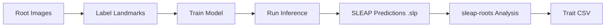

# What is SLEAP?

[SLEAP](https://sleap.ai) (Social LEAP Estimates Animal Poses) is a deep learning framework for multi-animal pose estimation. While designed for tracking animal body parts, SLEAP works exceptionally well for plant root phenotyping.

## Why SLEAP for Roots?

**SLEAP excels at identifying keypoints in images and learning their structural connections.** For plant roots, this means the neural network directly outputs a graph representation – nodes (landmarks) and edges (skeleton connections) – for each root, with multiple roots grouped per plant.

### Key Advantages for Root Phenotyping

What makes SLEAP powerful for roots is **the direct extraction of structured graphs from images**:

- **No post-processing** – Get root skeletons directly from the neural network output
- **Efficient trait computation** – Any geometric trait can be constructed from the extracted nodes and edges
- **Multi-instance detection** – Detect multiple roots simultaneously in each frame
- **Temporal tracking** – Associate roots across frames (works best with minimal occlusions; may require proofreading)
- **Flexible architectures** – Define custom skeletons for different root types (primary, lateral, crown)
- **Fast inference** – GPU-accelerated prediction scales to large datasets

## SLEAP Workflow

The typical SLEAP workflow for root phenotyping:



1. **Collect images** – Time-lapse or single time-point root images
2. **Label landmarks** – Annotate key points (tips, bases, nodes) in SLEAP GUI
3. **Train model** – Use SLEAP to train a pose estimation model
4. **Run inference** – Generate predictions (`.slp` files) for all images
5. **Analyze with sleap-roots** – Extract morphological traits from predictions

## Root Skeleton Design

A SLEAP skeleton defines the structure of landmarks to track. For roots, we typically use:

### Dicot Skeleton (Primary + Lateral Roots)

```
Primary Root:
  base → node1 → node2 → ... → tip

Lateral Roots (multiple instances):
  base → node1 → node2 → ... → tip
```

### Monocot Skeleton (Crown Roots)

```
Crown Roots (multiple instances):
  base → node1 → node2 → ... → tip
```

Each root is a connected chain of landmarks from base to tip.

## Prediction Files (.slp)

SLEAP generates `.slp` files containing:

- **Landmark coordinates** (x, y) for each point
- **Instance tracks** – Which points belong to which root
- **Confidence scores** – Model certainty for each prediction
- **Frame associations** – Temporal tracking across frames

sleap-roots uses the [sleap-io](https://github.com/talmolab/sleap-io) library to load and parse these files.

## Example: Loading SLEAP Predictions

```python
import sleap_io as sio

# Load predictions
labels = sio.load_slp("primary_roots.slp")

# Access first frame
frame = labels.labeled_frames[0]

# Get first instance (root)
instance = frame.instances[0]

# Get landmark points
for node, point in instance.points.items():
    print(f"{node.name}: ({point.x:.1f}, {point.y:.1f})")
```

Output:
```
base: (245.3, 189.2)
node1: (247.1, 210.5)
node2: (248.9, 231.8)
...
tip: (256.4, 523.7)
```

## From SLEAP to Traits

sleap-roots converts SLEAP predictions into trait measurements:

```python
import sleap_roots as sr

# Load SLEAP predictions
series = sr.Series.load(
    series_name="my_plant",
    primary_path="primary_roots.slp",
    lateral_path="lateral_roots.slp"
)

# Extract points for a frame
pts = series.get_primary_points(frame_idx=0)
# pts is a (n_points, 2) numpy array of (x, y) coordinates

# Compute length from points
from sleap_roots.lengths import get_root_lengths
length = get_root_lengths(pts)
```

The `Series` class handles loading, organizing, and extracting point data from SLEAP files.

## Data Organization

### Single Root Type

For experiments with only one root type (e.g., primary only):

```
my_plant.slp  # SLEAP predictions
my_plant.h5   # Optional: original video
```

Load with:
```python
series = sr.Series.load(
    series_name="my_plant",
    primary_path="my_plant.slp",
    h5_path="my_plant.h5"  # Optional
)
```

### Multiple Root Types

For dicots (primary + lateral) or monocots (primary + crown):

```
my_plant.primary.slp  # Primary root predictions
my_plant.lateral.slp  # Lateral root predictions
my_plant.h5           # Optional: video
```

Load with:
```python
series = sr.Series.load(
    series_name="my_plant",
    primary_path="my_plant.primary.slp",
    lateral_path="my_plant.lateral.slp",
    h5_path="my_plant.h5"
)
```

### Batch Experiments

For high-throughput experiments:

```
experiment/
  plant1.primary.slp
  plant1.lateral.slp
  plant1.h5
  plant2.primary.slp
  plant2.lateral.slp
  plant2.h5
  ...
```

Use auto-discovery:
```python
paths = sr.find_all_slp_paths("experiment/")
plants = sr.load_series_from_slps(paths, h5s=True)
```

## SLEAP vs sleap-roots

| Tool | Purpose | Output |
|------|---------|--------|
| **SLEAP** | Pose estimation | Landmark coordinates (.slp) |
| **sleap-roots** | Trait extraction | Morphological measurements (CSV) |

**SLEAP** is upstream – it detects and tracks root landmarks.
**sleap-roots** is downstream – it computes biological traits from those landmarks.

## Learning SLEAP

To get started with SLEAP for root phenotyping:

1. **Official SLEAP Docs** – [https://sleap.ai/tutorials/](https://sleap.ai/tutorials/)
2. **Video Tutorial** – SLEAP GUI walkthrough on YouTube
3. **Example Projects** – Use sleap-roots test data as reference
4. **Community** – [SLEAP Discussions](https://github.com/talmolab/sleap/discussions)

## Best Practices for Root Labeling

When creating SLEAP training data:

- **Label consistently** – Always start at base, end at tip
- **Label enough frames** – 50-100 frames is usually sufficient
- **Use suggestion mode** – Let SLEAP's active learning guide labeling
- **Label all instances** – Include all roots in each frame
- **Verify predictions** – Check inference quality before large-scale runs

## Coordinate Systems

SLEAP predictions use **image coordinates**:

- Origin (0, 0) is top-left corner
- X-axis increases rightward
- Y-axis increases **downward**

sleap-roots respects this coordinate system. For angle calculations, we account for the inverted Y-axis.

## Next Steps

- [Quick Start](quickstart.md) – Start analyzing SLEAP predictions
- [Pipeline Guide](../guides/index.md) – Choose the right pipeline
- [Batch Processing](../guides/batch-processing.md) – Process multiple plants
- [API Reference](../api/) – Complete trait definitions and function documentation