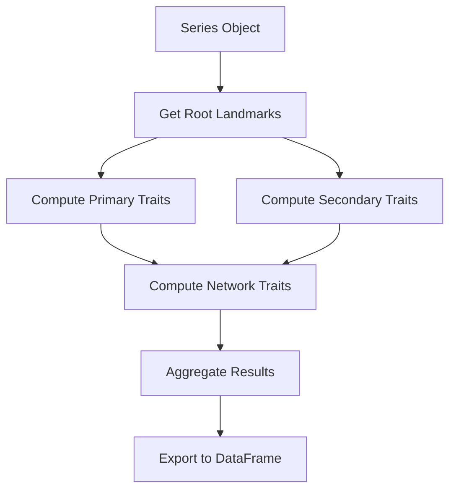

# Creating Custom Pipelines

This guide explains how to create custom trait computation pipelines for specialized root system architectures or research questions.

## Overview

sleap-roots provides pre-built pipelines for common root types (dicots, monocots, etc.), but you may need a custom pipeline for:

- Novel root architectures
- Specialized trait combinations
- Research-specific metrics
- Custom preprocessing steps
- Integration with external tools

## Pipeline Architecture

### Base Components

All pipelines inherit from a common base and implement:

```python
class BasePipeline:
    """Base class for trait computation pipelines."""

    def compute_plant_traits(self, series, write_csv=False, csv_path=None):
        """Compute traits for a single plant."""
        pass

    def get_trait_definitions(self):
        """Return metadata about computed traits."""
        pass
```

### Pipeline Flow



## Creating a Simple Custom Pipeline

### Step 1: Define Pipeline Class

```python
import sleap_roots as sr
import pandas as pd
from typing import Optional

class MyCustomPipeline:
    """Custom pipeline for my specific research question."""

    def __init__(self, primary_name: str = "base", lateral_name: str = "lateral"):
        """
        Initialize pipeline with custom parameters.

        Args:
            primary_name: Node name for primary root base.
            lateral_name: Node name for lateral root bases.
        """
        self.primary_name = primary_name
        self.lateral_name = lateral_name

    def compute_plant_traits(
        self,
        series: sr.Series,
        write_csv: bool = False,
        csv_path: Optional[str] = None
    ) -> pd.DataFrame:
        """
        Compute custom traits for a plant.

        Args:
            series: Series object with SLEAP predictions.
            write_csv: Whether to write results to CSV.
            csv_path: Optional path for CSV output.

        Returns:
            DataFrame with computed traits.
        """
        traits = {}

        # Get root landmarks
        primary_pts = series.get_primary_root_points()
        lateral_pts_list = series.get_lateral_root_points()

        # Compute your custom traits
        traits['my_custom_length'] = self._compute_custom_length(primary_pts)
        traits['my_custom_angle'] = self._compute_custom_angle(primary_pts)
        traits['my_lateral_metric'] = self._compute_lateral_metric(lateral_pts_list)

        # Convert to DataFrame
        df = pd.DataFrame([traits])

        # Optionally write to CSV
        if write_csv:
            output_path = csv_path or f"{series.series_name}_traits.csv"
            df.to_csv(output_path, index=False)

        return df

    def _compute_custom_length(self, pts):
        """Compute a custom length metric."""
        # Your custom logic here
        return sr.lengths.get_root_lengths([pts])[0]

    def _compute_custom_angle(self, pts):
        """Compute a custom angle metric."""
        # Your custom logic here
        return sr.angles.get_root_angle(pts, gravity_vector=(0, 1))

    def _compute_lateral_metric(self, lateral_pts_list):
        """Compute a custom lateral root metric."""
        # Your custom logic here
        return len(lateral_pts_list)
```

### Step 2: Use Your Pipeline

```python
# Load data
series = sr.Series.load(
    "my_plant",
    h5_path="predictions.h5",
    primary_path="primary.slp",
    lateral_path="lateral.slp"
)

# Apply custom pipeline
pipeline = MyCustomPipeline()
traits = pipeline.compute_plant_traits(series, write_csv=True)

print(traits)
```

## Advanced: Extending Existing Pipelines

### Inherit from DicotPipeline

Instead of building from scratch, extend an existing pipeline:

```python
class EnhancedDicotPipeline(sr.DicotPipeline):
    """DicotPipeline with additional custom traits."""

    def compute_plant_traits(self, series, write_csv=False, csv_path=None):
        """Compute standard dicot traits plus custom ones."""

        # Get standard dicot traits
        traits = super().compute_plant_traits(series, write_csv=False)

        # Add custom traits
        primary_pts = series.get_primary_root_points()
        traits['my_custom_metric'] = self._my_custom_computation(primary_pts)

        # Write to CSV if requested
        if write_csv:
            output_path = csv_path or f"{series.series_name}_enhanced_traits.csv"
            traits.to_csv(output_path, index=False)

        return traits

    def _my_custom_computation(self, pts):
        """Your custom trait computation."""
        # Example: compute tortuosity
        path_length = sr.lengths.get_root_lengths([pts])[0]
        euclidean_length = np.linalg.norm(pts[-1] - pts[0])
        return path_length / euclidean_length if euclidean_length > 0 else 1.0
```

## Trait Computation Utilities

### Available Modules

sleap-roots provides utility modules for common computations:

#### Length Calculations

```python
from sleap_roots import lengths

# Total path length
root_length = lengths.get_root_lengths([pts])[0]

# Smoothed length (reduces noise)
smooth_length = lengths.get_root_lengths_with_smoothing([pts], sigma=2)[0]

# Maximum length points (useful for skeletonization)
max_pts = lengths.get_max_length_pts(pts)
```

#### Angle Measurements

```python
from sleap_roots import angles

# Tip angle relative to gravity
tip_angle = angles.get_root_angle(pts, gravity_vector=(0, 1))

# Emergence angle for lateral roots
emergence_angle = angles.get_lateral_root_angle(
    primary_pt=base_point,
    lateral_pts=lateral_root_pts
)
```

#### Tip Detection

```python
from sleap_roots import tips

# Get root tip coordinates
tip_coords = tips.get_root_tips([pts])

# Tip angle using local tangent
tip_angle = tips.get_tip_angle(pts, window_size=5)
```

#### Base Detection

```python
from sleap_roots import bases

# Count lateral root bases
base_count = bases.count_root_bases(lateral_pts_list)

# Get base positions
base_positions = bases.get_root_base_positions(primary_pts, lateral_pts_list)
```

#### Network Analysis

```python
from sleap_roots import networklength

# Total network length
total_length = networklength.get_network_length(primary_pts, lateral_pts_list)

# Network distribution metrics
metrics = networklength.get_network_distribution(primary_pts, lateral_pts_list)
```

#### Morphology Metrics

```python
from sleap_roots import convhull

# Convex hull area
hull_area = convhull.get_convhull_area(pts_list)

# Perimeter
hull_perimeter = convhull.get_convhull_perimeter(pts_list)
```

## Complex Example: Multi-Root Architecture

Here's a complete example for a custom architecture with multiple root types:

```python
import sleap_roots as sr
import pandas as pd
import numpy as np

class TripleRootPipeline:
    """Pipeline for plants with primary, lateral, and adventitious roots."""

    def __init__(self):
        self.primary_name = "primary_base"
        self.lateral_name = "lateral_base"
        self.adventitious_name = "adventitious_base"

    def compute_plant_traits(self, series, write_csv=False, csv_path=None):
        """Compute traits for three root types."""
        traits = {}

        # Get all three root types
        primary_pts = series.get_primary_root_points()
        lateral_pts_list = series.get_lateral_root_points()
        adventitious_pts_list = self._get_adventitious_points(series)

        # Primary root traits
        traits.update(self._compute_primary_traits(primary_pts))

        # Lateral root traits
        traits.update(self._compute_lateral_traits(lateral_pts_list))

        # Adventitious root traits
        traits.update(self._compute_adventitious_traits(adventitious_pts_list))

        # Combined network traits
        traits.update(self._compute_network_traits(
            primary_pts, lateral_pts_list, adventitious_pts_list
        ))

        df = pd.DataFrame([traits])

        if write_csv:
            output_path = csv_path or f"{series.series_name}_triple_traits.csv"
            df.to_csv(output_path, index=False)

        return df

    def _get_adventitious_points(self, series):
        """Extract adventitious root points from series."""
        # Custom logic to get adventitious roots
        # This depends on how they're stored in your SLEAP data
        return series.get_root_points_by_type(self.adventitious_name)

    def _compute_primary_traits(self, pts):
        """Compute primary root traits."""
        return {
            'primary_length': sr.lengths.get_root_lengths([pts])[0],
            'primary_angle': sr.angles.get_root_angle(pts, (0, 1))
        }

    def _compute_lateral_traits(self, lateral_pts_list):
        """Compute lateral root traits."""
        lengths_array = sr.lengths.get_root_lengths(lateral_pts_list)
        return {
            'lateral_count': len(lateral_pts_list),
            'lateral_total_length': np.sum(lengths_array),
            'lateral_mean_length': np.mean(lengths_array) if len(lengths_array) > 0 else 0
        }

    def _compute_adventitious_traits(self, adventitious_pts_list):
        """Compute adventitious root traits."""
        lengths_array = sr.lengths.get_root_lengths(adventitious_pts_list)
        return {
            'adventitious_count': len(adventitious_pts_list),
            'adventitious_total_length': np.sum(lengths_array),
            'adventitious_mean_length': np.mean(lengths_array) if len(lengths_array) > 0 else 0
        }

    def _compute_network_traits(self, primary_pts, lateral_pts_list, adventitious_pts_list):
        """Compute whole-system network traits."""
        all_roots = [primary_pts] + lateral_pts_list + adventitious_pts_list
        all_lengths = sr.lengths.get_root_lengths(all_roots)

        return {
            'total_root_count': len(all_roots),
            'total_system_length': np.sum(all_lengths),
            'convex_hull_area': sr.convhull.get_convhull_area(all_roots)
        }
```

## Trait Definition Metadata

Document your pipeline's traits for users:

```python
class MyCustomPipeline:
    def get_trait_definitions(self):
        """Return metadata about computed traits."""
        return {
            'my_custom_length': {
                'description': 'Custom length metric accounting for...',
                'units': 'pixels',
                'formula': 'sum(segment_lengths) * custom_factor'
            },
            'my_custom_angle': {
                'description': 'Angle measured from...',
                'units': 'degrees',
                'range': '0-360'
            }
        }
```

## Testing Your Pipeline

### Unit Tests

```python
import pytest
import sleap_roots as sr

def test_custom_pipeline():
    """Test custom pipeline on example data."""
    # Load test data
    series = sr.Series.load(
        "test_plant",
        h5_path="tests/data/test.h5",
        primary_path="tests/data/test_primary.slp"
    )

    # Run pipeline
    pipeline = MyCustomPipeline()
    traits = pipeline.compute_plant_traits(series)

    # Assertions
    assert 'my_custom_length' in traits.columns
    assert traits['my_custom_length'].iloc[0] > 0
    assert not traits.isnull().any().any()

def test_custom_trait_computation():
    """Test individual trait computation method."""
    pipeline = MyCustomPipeline()

    # Mock data
    pts = np.array([[0, 0], [1, 1], [2, 2]])

    # Test computation
    result = pipeline._compute_custom_length(pts)

    assert isinstance(result, float)
    assert result > 0
```

### Integration Tests

```python
def test_pipeline_end_to_end():
    """Test complete pipeline workflow."""
    # Load real data
    series = sr.Series.load(
        "real_plant",
        h5_path="data/predictions.h5",
        primary_path="data/primary.slp",
        lateral_path="data/lateral.slp"
    )

    # Run pipeline
    pipeline = MyCustomPipeline()
    traits = pipeline.compute_plant_traits(series, write_csv=True)

    # Verify output
    assert traits.shape[0] > 0  # Has rows
    assert traits.shape[1] > 0  # Has columns
    assert Path(f"{series.series_name}_traits.csv").exists()
```

## Best Practices

### 1. Modular Design

Break computations into small, testable functions:

```python
def _compute_trait_a(self, pts):
    """Single responsibility: compute trait A."""
    pass

def _compute_trait_b(self, pts):
    """Single responsibility: compute trait B."""
    pass
```

### 2. Error Handling

Handle edge cases gracefully:

```python
def _compute_custom_metric(self, pts):
    """Compute metric with error handling."""
    if len(pts) < 2:
        return np.nan  # Not enough points

    try:
        result = complex_computation(pts)
    except Exception as e:
        print(f"Warning: Computation failed - {e}")
        return np.nan

    return result
```

### 3. Documentation

Document your pipeline thoroughly:

```python
class MyCustomPipeline:
    """
    Custom pipeline for [specific research application].

    This pipeline computes traits for [root architecture description],
    specifically designed for [use case].

    Attributes:
        param1: Description of parameter 1.
        param2: Description of parameter 2.

    Example:
        >>> series = sr.Series.load(...)
        >>> pipeline = MyCustomPipeline(param1=value1)
        >>> traits = pipeline.compute_plant_traits(series)
    """
```

### 4. Reusable Components

Use existing utilities when possible:

```python
# Good: reuse existing utilities
from sleap_roots import lengths, angles

length = lengths.get_root_lengths([pts])[0]
angle = angles.get_root_angle(pts, (0, 1))

# Avoid: reimplementing common functions
# length = np.sum(np.linalg.norm(np.diff(pts, axis=0), axis=1))  # Don't do this
```

## Sharing Your Pipeline

To share your custom pipeline:

1. **Package it**:
```python
# my_custom_pipeline.py
import sleap_roots as sr

class MyCustomPipeline:
    # Your implementation
    pass
```

2. **Document it**:
Create a README explaining:
   - What root architecture it targets
   - What traits it computes
   - How to use it
   - Example data

3. **Test it**:
Include unit tests demonstrating correctness

4. **Share it**:
   - Create a GitHub repository
   - Publish to PyPI (optional)
   - Share with sleap-roots community

## Next Steps

- Review [Architecture](../dev/architecture.md) for pipeline design patterns
- See [Testing Guide](../dev/testing.md) for testing strategies
- Check [API Reference](../api/pipelines.md) for existing pipeline implementations
- Explore [Trait Reference](trait-reference.md) for trait computation details
- Read [Adding Traits](../dev/adding-traits.md) for contributing new trait computations