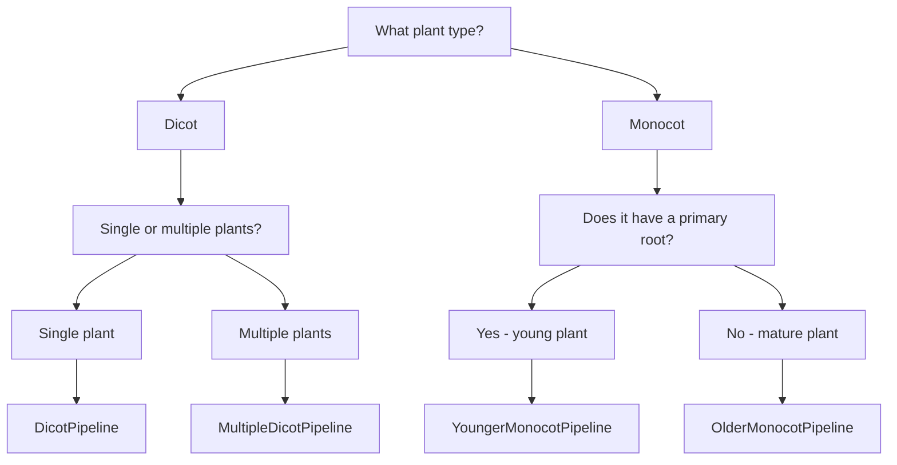

# Pipeline Guide

sleap-roots provides pre-built pipelines for different root system architectures. Choose the pipeline that matches your plant type and experimental setup.

## Available Pipelines

### Dicot Pipelines

<div class="grid cards" markdown>

-   **DicotPipeline**

    ---

    For dicots with primary and lateral roots.

    **Best for:** Soy, canola, arabidopsis

    **Root types:** Primary + Lateral

    **Traits:** 40+ including lengths, angles, counts, topology

    [:octicons-arrow-right-24: Learn more](pipelines/dicot.md)

-   **MultipleDicotPipeline**

    ---

    For multi-plant dicot setups (batch from single image).

    **Best for:** Multi-plant imaging systems

    **Root types:** Primary + Lateral (multiple plants)

    **Traits:** Same as DicotPipeline, per plant

    [:octicons-arrow-right-24: Learn more](pipelines/multiple-dicot.md)

</div>

### Monocot Pipelines

<div class="grid cards" markdown>

-   **YoungerMonocotPipeline**

    ---

    For young monocots with primary and crown roots.

    **Best for:** Early-stage rice, maize

    **Root types:** Primary + Crown

    **Traits:** 35+ including crown root metrics

    [:octicons-arrow-right-24: Learn more](pipelines/younger-monocot.md)

-   **OlderMonocotPipeline**

    ---

    For mature monocots (crown roots only, no primary).

    **Best for:** Later-stage rice, maize

    **Root types:** Crown only

    **Traits:** 25+ focused on crown root architecture

    [:octicons-arrow-right-24: Learn more](pipelines/older-monocot.md)

</div>

### Specialized Pipelines

<div class="grid cards" markdown>

-   **MultiplePrimaryRootPipeline**

    ---

    For plants with multiple primary roots.

    **Best for:** Specialized root architectures

    **Root types:** Multiple primary roots

    **Traits:** 30+ focused on multi-primary systems

    [:octicons-arrow-right-24: Learn more](pipelines/multiple-primary.md)

-   **LateralRootPipeline**

    ---

    For lateral root analysis only.

    **Best for:** Focused lateral root studies

    **Root types:** Lateral only

    **Traits:** 20+ lateral-specific traits

    [:octicons-arrow-right-24: Learn more](pipelines/lateral-root.md)

</div>

## Choosing a Pipeline

Use this decision tree to select the appropriate pipeline:



### Quick Reference

| Plant Type | Growth Stage | Root Types | Pipeline |
|------------|--------------|------------|----------|
| Soy, canola, arabidopsis | Any | Primary + Lateral | `DicotPipeline` |
| Rice, maize, wheat | Early (≤7 days) | Primary + Crown | `YoungerMonocotPipeline` |
| Rice, maize, wheat | Late (>7 days) | Crown only | `OlderMonocotPipeline` |
| Multiple dicots | Any | Primary + Lateral | `MultipleDicotPipeline` |
| Special architecture | Any | Multiple primary | `MultiplePrimaryRootPipeline` |
| Lateral root focus | Any | Lateral only | `LateralRootPipeline` |

## Pipeline Components

All pipelines share a common structure:

### 1. Series Loading

Load SLEAP predictions into a `Series` object:

```python
import sleap_roots as sr

series = sr.Series.load(
    series_name="my_plant",
    primary_path="primary.slp",
    lateral_path="lateral.slp",  # Optional, depending on pipeline
    h5_path="video.h5"  # Optional
)
```

### 2. Pipeline Instantiation

Create a pipeline instance:

```python
pipeline = sr.DicotPipeline()
```

### 3. Trait Computation

Compute traits for single plant or batch:

```python
# Single plant
traits = pipeline.compute_plant_traits(series, write_csv=True)

# Batch processing
plants = sr.load_series_from_slps(paths, h5s=True)
batch_traits = pipeline.compute_batch_traits(plants, write_csv=True)
```

## Common Workflows

### Time-Series Analysis

For plants imaged over time:

```python
import sleap_roots as sr

# Load time-series data
series = sr.Series.load(
    series_name="plant_growth",
    primary_path="timeseries.primary.slp",
    lateral_path="timeseries.lateral.slp"
)

# Compute traits for each frame
pipeline = sr.DicotPipeline()
traits = pipeline.compute_plant_traits(series, write_csv=True)

# traits will have one row per frame
# Analyze growth over time
import matplotlib.pyplot as plt
plt.plot(traits['frame_idx'], traits['primary_length'])
plt.xlabel('Frame')
plt.ylabel('Primary Root Length (pixels)')
plt.show()
```

### Multi-Plant Batch Processing

For high-throughput experiments:

```python
import sleap_roots as sr

# Auto-discover all SLEAP files
paths = sr.find_all_slp_paths("experiment_data/")

# Load all plants
plants = sr.load_series_from_slps(paths, h5s=True)

# Process batch
pipeline = sr.DicotPipeline()
batch_df = pipeline.compute_batch_traits(plants, write_csv=True)

# Analyze population statistics
print(batch_df.groupby('plant')['primary_length'].mean())
```

### Custom Trait Selection

Use individual trait functions for custom analyses:

```python
from sleap_roots.lengths import get_root_lengths
from sleap_roots.angles import get_primary_angle
import sleap_roots as sr

series = sr.Series.load(series_name="my_plant", primary_path="primary.slp")

# Compute only specific traits
pts = series.get_primary_points(frame_idx=0)
length = get_root_lengths(pts)
angle = get_primary_angle(pts)

print(f"Length: {length:.2f}, Angle: {angle:.2f}")
```

## Customizing Pipelines

You can create custom pipelines by extending existing ones:

```python
from sleap_roots import DicotPipeline, TraitDef

class MyCustomPipeline(DicotPipeline):
    def get_trait_definitions(self):
        # Get base traits
        base_traits = super().get_trait_definitions()

        # Add custom trait
        custom_trait = TraitDef(
            name="my_custom_trait",
            description="My custom measurement",
            compute_fn=lambda s, f: self._compute_custom(s, f)
        )

        return base_traits + [custom_trait]

    def _compute_custom(self, series, frame_idx):
        # Your custom logic here
        return 42.0

# Use custom pipeline
pipeline = MyCustomPipeline()
traits = pipeline.compute_plant_traits(series, write_csv=True)
```

See [Creating Pipelines](../dev/creating-pipelines.md) for more details.

## Output Format

All pipelines output CSV files with consistent structure:

| Column | Description | Type |
|--------|-------------|------|
| `plant` | Plant identifier | str |
| `frame_idx` | Frame number | int |
| `primary_length` | Primary root length | float |
| `lateral_count` | Number of lateral roots | int |
| ... | Other traits | float/int |

See [Trait Reference](trait-reference.md) for complete trait descriptions.

## Next Steps

- Explore detailed pipeline documentation in the [Pipelines](pipelines/dicot.md) section
- See the [Trait Reference](trait-reference.md) for all computed traits
- Learn about [Batch Processing](batch-processing.md) for high-throughput workflows
- Check the [API Reference](../reference/) for detailed function documentation