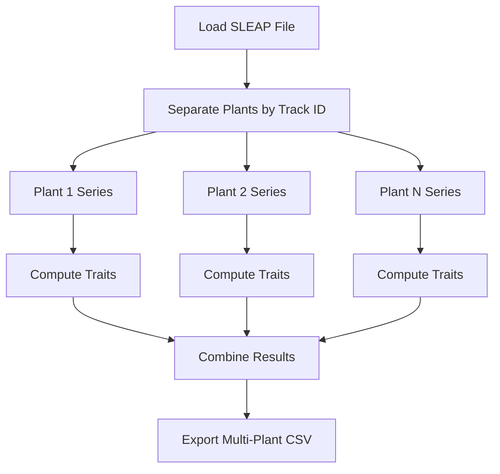

# Multiple Dicot Pipeline Tutorial

This tutorial demonstrates batch analysis of multiple dicot plants in a single image using the `MultipleDicotPipeline`. This pipeline extends the standard dicot analysis to handle multi-plant experimental setups.

## What You'll Learn

- Analyze multiple dicot plants simultaneously
- Handle plant separation and identification
- Compute per-plant traits in batch
- Export organized multi-plant results

## Pipeline Overview

The `MultipleDicotPipeline` processes multiple plants by:

1. **Identifying individual plants** from SLEAP tracks
2. **Computing dicot traits** for each plant independently
3. **Organizing results** by plant ID
4. **Exporting** combined CSV with all plants

## Interactive Tutorial

{{ '../../notebooks/MultipleDicotPipeline.ipynb' }}

## When to Use This Pipeline

### Experimental Designs

Ideal for:

- **High-throughput phenotyping**: Multiple plants per image
- **Comparative studies**: Multiple genotypes or treatments in one frame
- **Space-efficient imaging**: Maximize plants per image
- **Simultaneous growth tracking**: Track development of multiple individuals

### Setup Requirements

Your SLEAP predictions must:

- Use **track IDs** to distinguish individual plants
- Have consistent node naming across all plants
- Include both primary and lateral roots for each plant
- Maintain track continuity across frames

## Multi-Plant Workflow

### Data Organization

```
Single Image → Multiple SLEAP Tracks
                ├── Track 0 (Plant A): Primary + Laterals
                ├── Track 1 (Plant B): Primary + Laterals
                ├── Track 2 (Plant C): Primary + Laterals
                └── Track 3 (Plant D): Primary + Laterals
```

### Processing Flow



## Usage Examples

### Basic Multi-Plant Analysis

```python
import sleap_roots as sr

# Load all plants from single file
series_list = sr.Series.load_multi(
    h5_path="multi_plant.h5",
    primary_path="primary.slp",
    lateral_path="lateral.slp"
)

# Process all plants
pipeline = sr.MultipleDicotPipeline()
all_traits = pipeline.compute_multi_plant_traits(
    series_list,
    write_csv=True,
    csv_path="all_plants_traits.csv"
)

print(f"Processed {len(series_list)} plants")
print(all_traits.head())
```

### Per-Plant Iteration

```python
# Process each plant individually with custom logic
results = []
for i, series in enumerate(series_list):
    print(f"Processing plant {i+1}/{len(series_list)}")

    traits = pipeline.compute_plant_traits(series)
    traits['plant_id'] = i
    traits['genotype'] = get_genotype(i)  # Custom metadata

    results.append(traits)

df = pd.concat(results)
```

### Filtering Plants

```python
# Only process plants with sufficient data
valid_plants = [
    series for series in series_list
    if series.primary_pts.shape[0] > 100  # Minimum primary root points
]

traits = pipeline.compute_multi_plant_traits(valid_plants)
```

## Key Considerations

### Plant Separation

**Critical**: SLEAP tracking must correctly separate plants

✅ Good tracking:
- Each plant has unique, consistent track ID
- No track swapping between plants
- Complete tracks from base to tip

❌ Poor tracking issues:
- Track IDs swap between frames
- Multiple plants share same track
- Fragmented tracks

### Trait Organization

Output CSV structure:

| plant_id | frame | primary_length | lateral_count | ... |
|----------|-------|----------------|---------------|-----|
| plant_0  | 0     | 245.3          | 5             | ... |
| plant_0  | 1     | 247.1          | 5             | ... |
| plant_1  | 0     | 198.7          | 3             | ... |
| plant_1  | 1     | 201.2          | 4             | ... |

### Performance Optimization

For many plants:

```python
from multiprocessing import Pool

def process_plant(series):
    pipeline = sr.MultipleDicotPipeline()
    return pipeline.compute_plant_traits(series)

# Parallel processing
with Pool(processes=4) as pool:
    results = pool.map(process_plant, series_list)

df = pd.concat(results)
```

## Comparison Analysis

### Genotype Comparison

```python
import seaborn as sns
import matplotlib.pyplot as plt

# Assuming metadata is added
all_traits['genotype'] = ['A', 'A', 'B', 'B', ...]

sns.boxplot(data=all_traits, x='genotype', y='primary_length')
plt.title('Primary Root Length by Genotype')
plt.show()
```

### Treatment Effects

```python
# Compare control vs. treatment
control = all_traits[all_traits['treatment'] == 'control']
treated = all_traits[all_traits['treatment'] == 'nitrogen']

print(f"Control mean lateral count: {control['lateral_count'].mean():.1f}")
print(f"Treated mean lateral count: {treated['lateral_count'].mean():.1f}")
```

## Common Issues

### Track Swapping

**Problem**: Plant identities swap between frames

**Solution**:
- Review SLEAP tracking parameters
- Use stricter tracking thresholds
- Manually correct in SLEAP GUI if needed

### Overlapping Plants

**Problem**: Root systems overlap, hard to separate

**Solution**:
- Increase plant spacing in imaging setup
- Use colored markers or labels in image
- Employ instance segmentation in SLEAP model

### Variable Plant Count

**Problem**: Different number of plants across timepoints

**Solution**:
```python
# Handle missing plants gracefully
for frame in range(num_frames):
    frame_plants = [s for s in series_list if frame in s.frame_indices]
    traits = pipeline.compute_multi_plant_traits(frame_plants)
    # Process frame-specific results
```

## Export Options

### Standard CSV

```python
all_traits.to_csv('multi_plant_traits.csv', index=False)
```

### Per-Plant Files

```python
for plant_id, group in all_traits.groupby('plant_id'):
    group.to_csv(f'plant_{plant_id}_traits.csv', index=False)
```

### Wide Format for Statistics

```python
# Pivot for statistical software
wide_format = all_traits.pivot(
    index='frame',
    columns='plant_id',
    values='primary_length'
)
wide_format.to_csv('traits_wide.csv')
```

## Next Steps

- See [Multiple Primary Root Pipeline](multiple-primary-root-pipeline.md) for simpler multi-plant setups
- Read [Batch Processing](../guides/batch-processing.md) for large-scale experiments
- Explore [Statistical Analysis Cookbook](../cookbook/batch-optimization.md)
- Learn about [Custom Pipelines](../guides/custom-pipelines.md) for specialized multi-plant needs