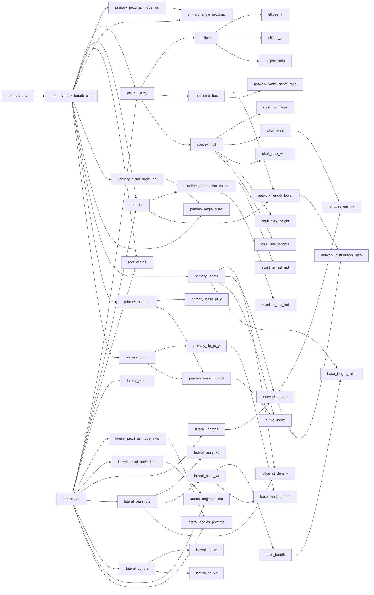

```mermaid
graph LR
    primary_pts --> primary_max_length_pts
    primary_max_length_pts --> pts_all_array
    lateral_pts --> pts_all_array
    primary_max_length_pts --> pts_list
    lateral_pts --> pts_list
    primary_max_length_pts --> root_widths
    lateral_pts --> root_widths
    lateral_pts --> lateral_count
    lateral_pts --> lateral_proximal_node_inds
    lateral_pts --> lateral_distal_node_inds
    lateral_pts --> lateral_lengths
    lateral_pts --> lateral_base_pts
    lateral_pts --> lateral_tip_pts
    pts_list --> scanline_intersection_counts
    lateral_pts --> lateral_angles_distal
    lateral_distal_node_inds --> lateral_angles_distal
    lateral_pts --> lateral_angles_proximal
    lateral_proximal_node_inds --> lateral_angles_proximal
    network_length --> network_solidity
    chull_area --> network_solidity
    pts_all_array --> ellipse
    pts_all_array --> bounding_box
    pts_all_array --> convex_hull
    primary_max_length_pts --> primary_proximal_node_ind
    primary_max_length_pts --> primary_angle_proximal
    primary_proximal_node_ind --> primary_angle_proximal
    primary_max_length_pts --> primary_distal_node_ind
    primary_max_length_pts --> primary_angle_distal
    primary_distal_node_ind --> primary_angle_distal
    primary_max_length_pts --> primary_length
    primary_max_length_pts --> primary_base_pt
    primary_max_length_pts --> primary_tip_pt
    pts_list --> network_length_lower
    bounding_box --> network_length_lower
    lateral_base_pts --> lateral_base_xs
    lateral_base_pts --> lateral_base_ys
    primary_length --> base_ct_density
    lateral_base_pts --> base_ct_density
    lateral_tip_pts --> lateral_tip_xs
    lateral_tip_pts --> lateral_tip_ys
    network_length --> network_distribution_ratio
    network_length_lower --> network_distribution_ratio
    primary_length --> network_length
    lateral_lengths --> network_length
    primary_base_pt --> primary_base_pt_y
    primary_tip_pt --> primary_tip_pt_y
    ellipse --> ellipse_a
    ellipse --> ellipse_b
    bounding_box --> network_width_depth_ratio
    convex_hull --> chull_perimeter
    convex_hull --> chull_area
    convex_hull --> chull_max_width
    convex_hull --> chull_max_height
    convex_hull --> chull_line_lengths
    lateral_base_ys --> base_length
    lateral_base_ys --> base_median_ratio
    primary_tip_pt_y --> base_median_ratio
    primary_length --> curve_index
    primary_base_tip_dist --> curve_index
    primary_length --> base_length_ratio
    base_length --> base_length_ratio
    primary_base_pt --> primary_base_tip_dist
    primary_tip_pt --> primary_base_tip_dist
    ellipse --> ellipse_ratio
    scanline_intersection_counts --> scanline_last_ind
    scanline_intersection_counts --> scanline_first_ind
```

Distinct Traits for DicotPipeline: 52
