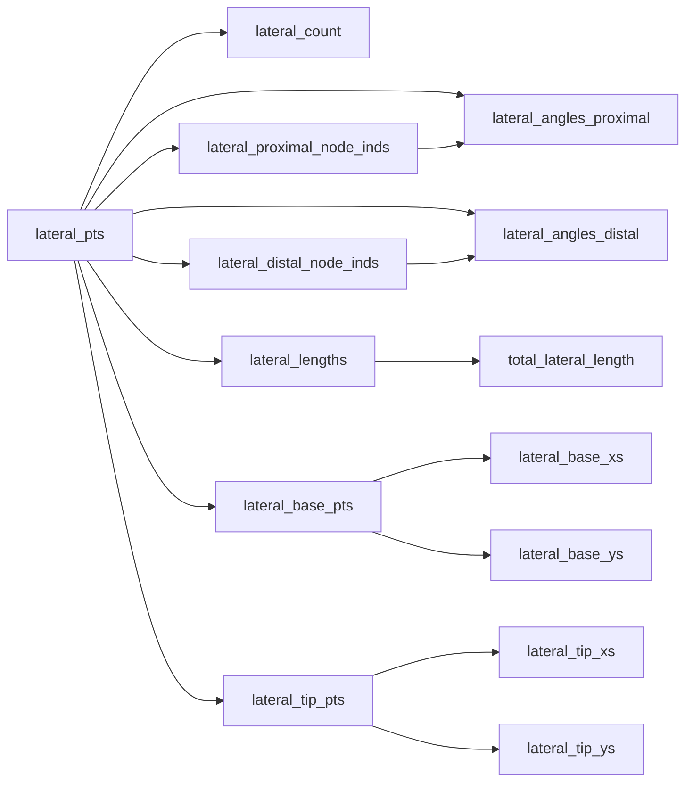

```mermaid
graph LR
    lateral_pts --> lateral_count
    lateral_pts --> lateral_proximal_node_inds
    lateral_pts --> lateral_distal_node_inds
    lateral_pts --> lateral_lengths
    lateral_lengths --> total_lateral_length
    lateral_pts --> lateral_base_pts
    lateral_pts --> lateral_tip_pts
    lateral_pts --> lateral_angles_distal
    lateral_distal_node_inds --> lateral_angles_distal
    lateral_pts --> lateral_angles_proximal
    lateral_proximal_node_inds --> lateral_angles_proximal
    lateral_base_pts --> lateral_base_xs
    lateral_base_pts --> lateral_base_ys
    lateral_tip_pts --> lateral_tip_xs
    lateral_tip_pts --> lateral_tip_ys
```

Distinct Traits for LateralRootPipeline: 14
