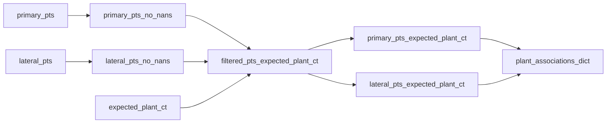

```mermaid
graph LR
    primary_pts --> primary_pts_no_nans
    lateral_pts --> lateral_pts_no_nans
    primary_pts_no_nans --> filtered_pts_expected_plant_ct
    lateral_pts_no_nans --> filtered_pts_expected_plant_ct
    expected_plant_ct --> filtered_pts_expected_plant_ct
    filtered_pts_expected_plant_ct --> primary_pts_expected_plant_ct
    filtered_pts_expected_plant_ct --> lateral_pts_expected_plant_ct
    primary_pts_expected_plant_ct --> plant_associations_dict
    lateral_pts_expected_plant_ct --> plant_associations_dict
```

Distinct Traits for MultipleDicotPipeline: 9
