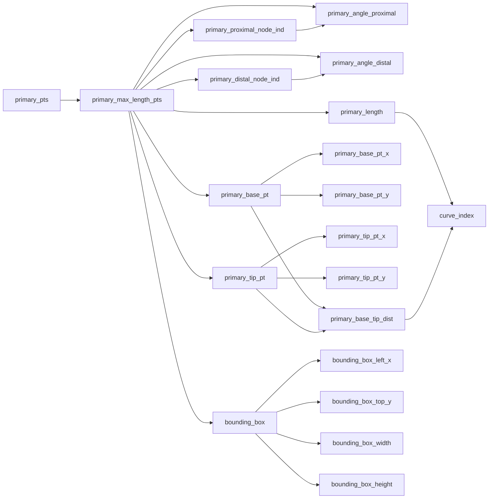

```mermaid
graph LR
    primary_pts --> primary_max_length_pts
    primary_max_length_pts --> primary_proximal_node_ind
    primary_max_length_pts --> primary_distal_node_ind
    primary_max_length_pts --> primary_angle_proximal
    primary_proximal_node_ind --> primary_angle_proximal
    primary_max_length_pts --> primary_angle_distal
    primary_distal_node_ind --> primary_angle_distal
    primary_max_length_pts --> primary_length
    primary_max_length_pts --> primary_base_pt
    primary_max_length_pts --> primary_tip_pt
    primary_base_pt --> primary_base_pt_x
    primary_base_pt --> primary_base_pt_y
    primary_tip_pt --> primary_tip_pt_x
    primary_tip_pt --> primary_tip_pt_y
    primary_base_pt --> primary_base_tip_dist
    primary_tip_pt --> primary_base_tip_dist
    primary_length --> curve_index
    primary_base_tip_dist --> curve_index
    primary_max_length_pts --> bounding_box
    bounding_box --> bounding_box_left_x
    bounding_box --> bounding_box_top_y
    bounding_box --> bounding_box_width
    bounding_box --> bounding_box_height
```

Distinct Traits for PrimaryRootPipeline: 20
