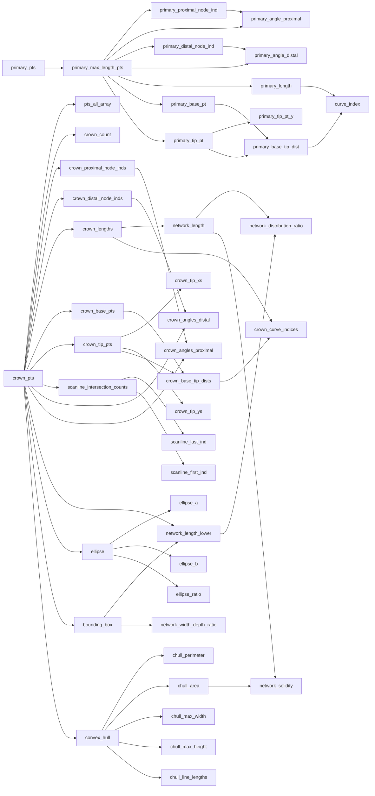

```mermaid
graph LR
    primary_pts --> primary_max_length_pts
    crown_pts --> pts_all_array
    crown_pts --> crown_count
    crown_pts --> crown_proximal_node_inds
    crown_pts --> crown_distal_node_inds
    crown_pts --> crown_lengths
    crown_pts --> crown_base_pts
    crown_pts --> crown_tip_pts
    crown_pts --> scanline_intersection_counts
    crown_pts --> crown_angles_distal
    crown_distal_node_inds --> crown_angles_distal
    crown_pts --> crown_angles_proximal
    crown_proximal_node_inds --> crown_angles_proximal
    crown_pts --> network_length_lower
    bounding_box --> network_length_lower
    crown_pts --> ellipse
    crown_pts --> bounding_box
    crown_pts --> convex_hull
    primary_max_length_pts --> primary_proximal_node_ind
    primary_max_length_pts --> primary_angle_proximal
    primary_proximal_node_ind --> primary_angle_proximal
    primary_max_length_pts --> primary_distal_node_ind
    primary_max_length_pts --> primary_angle_distal
    primary_distal_node_ind --> primary_angle_distal
    primary_max_length_pts --> primary_length
    primary_max_length_pts --> primary_base_pt
    primary_max_length_pts --> primary_tip_pt
    crown_tip_pts --> crown_tip_xs
    crown_tip_pts --> crown_tip_ys
    network_length --> network_distribution_ratio
    network_length_lower --> network_distribution_ratio
    crown_lengths --> network_length
    crown_base_pts --> crown_base_tip_dists
    crown_tip_pts --> crown_base_tip_dists
    crown_lengths --> crown_curve_indices
    crown_base_tip_dists --> crown_curve_indices
    network_length --> network_solidity
    chull_area --> network_solidity
    primary_tip_pt --> primary_tip_pt_y
    ellipse --> ellipse_a
    ellipse --> ellipse_b
    bounding_box --> network_width_depth_ratio
    convex_hull --> chull_perimeter
    convex_hull --> chull_area
    convex_hull --> chull_max_width
    convex_hull --> chull_max_height
    convex_hull --> chull_line_lengths
    primary_length --> curve_index
    primary_base_tip_dist --> curve_index
    primary_base_pt --> primary_base_tip_dist
    primary_tip_pt --> primary_base_tip_dist
    ellipse --> ellipse_ratio
    scanline_intersection_counts --> scanline_last_ind
    scanline_intersection_counts --> scanline_first_ind
```

Distinct Traits for YoungerMonocotPipeline: 45
