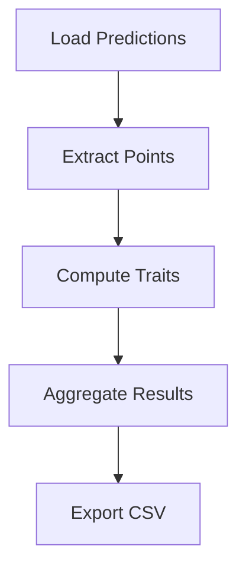

# Design: Add MkDocs Documentation

## Overview

This design outlines the architecture, tooling, and content organization for comprehensive MkDocs-based documentation for sleap-roots, targeting both end users (researchers) and developers.

## Goals

### Primary Goals
1. **Accessibility**: Researchers without programming expertise can use sleap-roots effectively
2. **Discoverability**: Users can find features, pipelines, and traits easily
3. **Maintainability**: Documentation stays in sync with code automatically
4. **Completeness**: Cover all pipelines, traits, and APIs comprehensively
5. **Scientific Rigor**: Document trait computation methods with formulas and validation

### Secondary Goals
6. **Developer onboarding**: New contributors can understand architecture quickly
7. **Versioning**: Support multiple documentation versions for different releases
8. **Search**: Fast, relevant search results
9. **Aesthetics**: Modern, professional appearance matching Talmo Lab branding

## Architecture

### Technology Stack

**Core:**
- **MkDocs** (1.5+) - Static site generator
- **Material for MkDocs** (9.0+) - Modern theme with excellent UX
- **Python Markdown** - Enhanced markdown processing

**Plugins:**
- **mkdocstrings** - Auto-generate API docs from docstrings
- **mkdocs-gen-files** - Generate pages programmatically (trait reference)
- **mkdocs-literate-nav** - Navigation from markdown files
- **mkdocs-section-index** - Section landing pages
- **mike** - Multi-version documentation
- **mkdocs-jupyter** - Embed Jupyter notebooks

**Extensions:**
- **PyMdown Extensions** - Enhanced markdown (code highlighting, tabs, admonitions)
- **Mermaid** - Diagrams (architecture, dependency graphs)
- **MathJax** - Mathematical formulas for trait calculations

### Site Architecture

```
https://talmolab.github.io/sleap-roots/
├── / (latest version)
│   ├── index.html                          # Landing page
│   ├── installation/
│   ├── quickstart/
│   ├── guides/
│   │   ├── user/
│   │   │   ├── pipelines/                  # Pipeline tutorials
│   │   │   ├── data-preparation/
│   │   │   ├── batch-processing/
│   │   │   └── troubleshooting/
│   │   └── developer/
│   │       ├── contributing/
│   │       ├── architecture/
│   │       ├── adding-pipelines/
│   │       └── testing/
│   ├── traits/
│   │   ├── index/                          # Trait overview
│   │   ├── lengths/                        # Length-based traits
│   │   ├── angles/                         # Angular traits
│   │   ├── topology/                       # Network traits
│   │   └── reference/                      # Auto-generated full list
│   ├── api/
│   │   ├── index/                          # API overview
│   │   ├── pipelines/                      # Pipeline classes
│   │   ├── series/                         # Series class
│   │   └── traits/                         # Trait computation modules
│   ├── cookbook/                           # Recipes and examples
│   └── changelog/
└── /v0.1.4/ (versioned docs)
    └── (same structure)
```

## Content Organization

### User Documentation

#### 1. Landing Page (index.md)

**Purpose:** First impression, quick navigation to key resources

**Content:**
- Hero section with tagline: "Fast and Efficient Root Phenotyping"
- Key features (multiple pipelines, 50+ traits, batch processing)
- Quick links to: Installation, Quickstart, Pipeline Guides, API Reference
- Citation information
- GitHub stars/downloads badges

**Design:**
- Large, visually appealing with plant imagery
- Clear call-to-action buttons
- Responsive grid layout

---

#### 2. Installation Guide

**Purpose:** Get users set up correctly

**Content:**
- Prerequisites (Python 3.7+, conda recommended)
- Installation methods:
  - conda + pip (recommended)
  - pip only
  - Development installation
- Verification steps
- Troubleshooting common install issues
- Platform-specific notes (Windows, macOS, Ubuntu)

**Design:**
- Step-by-step with code blocks
- Copy buttons for commands
- Admonitions for warnings/tips
- Tabs for different install methods

---

#### 3. Quickstart Tutorial

**Purpose:** First successful analysis in 5 minutes

**Content:**
- Load example data
- Choose pipeline for plant type
- Compute traits
- Examine output
- Next steps (links to full tutorials)

**Design:**
- Linear narrative
- Complete, runnable code blocks
- Expected output shown
- Explanatory text between code blocks

---

#### 4. Pipeline Tutorials

**Purpose:** Deep dive into each pipeline type

**Structure:**
```markdown
# DicotPipeline

## When to Use
- Dicot plants (soy, canola, arabidopsis)
- Have primary root + lateral roots
- Single plant per image

## Traits Computed
- [Link to trait reference]
- List of key traits with brief descriptions

## Example: Single Plant

[Full code example with comments]

## Example: Batch Processing

[Batch code example]

## Output Format

[Sample CSV with explanation of columns]

## Tips and Tricks
- Best practices
- Common pitfalls
- Performance optimization

## See Also
- [Related pipelines]
- [Trait reference]
- [API documentation]
```

---

#### 5. Trait Reference

**Purpose:** Comprehensive, searchable trait catalog

**Design Decision: Two-Level Approach**

**Level 1: Categorical Guides** (Human-written)
- `traits/lengths.md` - Explain length-based measurements conceptually
- `traits/angles.md` - Explain angular measurements
- `traits/topology.md` - Explain network/convex hull metrics

**Level 2: Auto-Generated Reference** (Machine-generated)
- `traits/reference.md` - Table of ALL traits with:
  - Name
  - Description (from TraitDef)
  - Computation method (function name)
  - Units
  - Pipelines that include it
  - Link to API docs for computation function

**Auto-Generation Strategy:**

```python
# docs/gen_trait_docs.py
from sleap_roots import trait_pipelines
import inspect

def generate_trait_reference():
    traits = {}
    
    # Collect traits from all pipelines
    for name, cls in inspect.getmembers(trait_pipelines):
        if name.endswith('Pipeline') and hasattr(cls, 'get_trait_definitions'):
            pipeline = cls()
            for trait in pipeline.get_trait_definitions():
                if trait.name not in traits:
                    traits[trait.name] = {
                        'description': trait.description,
                        'compute_fn': trait.compute_fn.__name__,
                        'pipelines': []
                    }
                traits[trait.name]['pipelines'].append(name)
    
    # Generate markdown table
    markdown = "| Trait | Description | Computation | Pipelines |\n"
    markdown += "|-------|-------------|-------------|-----------|\\n"
    for name, info in sorted(traits.items()):
        pipelines = ", ".join(info['pipelines'])
        markdown += f"| {name} | {info['description']} | "
        markdown += f"[{info['compute_fn']}](../api/{module}#{func}) | "
        markdown += f"{pipelines} |\\n"
    
    return markdown
```

---

### Developer Documentation

#### 6. Architecture Guide

**Purpose:** Understand sleap-roots design

**Content:**
```markdown
# Architecture

## Design Philosophy
- Pipeline-based trait computation
- Series-centric data model
- Modular trait functions
- Composable pipelines

## Core Concepts

### Series Object
[Diagram showing Series structure]
- Encapsulates predictions + images
- Primary, lateral, crown root access
- Frame-based indexing

### Pipeline Pattern
[Diagram showing Pipeline inheritance]
- Abstract Pipeline base class
- TraitDef specification
- compute_traits() contract
- Batch processing support

### Trait Computation Flow
[Mermaid diagram]
1. Load predictions (sleap-io)
2. Extract points per frame
3. Compute traits
4. Aggregate results
5. Export to CSV

## Module Organization
- `trait_pipelines.py` - Pipeline classes
- `series.py` - Data loading
- `lengths.py`, `angles.py`, etc. - Trait computation
- `summary.py` - Aggregation

## Dependency Graph
[Mermaid diagram showing module dependencies]
```

**Design:**
- Heavy use of diagrams (Mermaid)
- Code examples showing patterns
- Links to relevant API docs

---

#### 7. Contributing Guide

**Purpose:** Onboard new contributors

**Content:**
- Development setup
- Code style (Black, pydocstyle, Google-style docstrings)
- Git workflow (feature branches, PRs)
- Testing requirements (pytest, coverage)
- Documentation requirements
- PR checklist
- Link to Claude commands for development

**Design:**
- Step-by-step onboarding
- Checklists
- Links to relevant tools

---

### API Documentation

#### 8. Auto-Generated API Reference

**Tool:** mkdocstrings with Python handler

**Configuration:**
```yaml
plugins:
  - mkdocstrings:
      handlers:
        python:
          options:
            show_source: true
            show_root_heading: true
            show_root_full_path: false
            docstring_style: google
            docstring_section_style: table
            merge_init_into_class: true
            show_signature_annotations: true
```

**Structure:**

Each module gets a dedicated page:

```markdown
# sleap_roots.lengths

::: sleap_roots.lengths
    options:
      members:
        - get_root_lengths
        - get_max_length_pts
        - get_root_lengths_max
      show_source: true
```

This auto-generates:
- Function signatures with type hints
- Google-style docstring sections (Args, Returns, Raises)
- Source code (collapsible)
- Examples from docstring

**Docstring Enhancement Strategy:**

Ensure all public functions have:
```python
def get_root_lengths(points: np.ndarray) -> float:
    """Calculate total Euclidean length of root from points.

    This computes the sum of distances between consecutive points
    along the root skeleton.

    Args:
        points: Array of shape (n, 2) containing x,y coordinates
            in pixel space (y-down image coordinates).

    Returns:
        Total length as a float (in pixels).

    Raises:
        ValueError: If points array is empty or has invalid shape.

    Examples:
        >>> import numpy as np
        >>> points = np.array([[0, 0], [3, 4], [6, 8]])
        >>> get_root_lengths(points)
        10.0

    See Also:
        - get_max_length_pts: Find longest path through points
        - get_root_lengths_max: Length of longest path

    Note:
        Assumes points are ordered along the root. For unordered
        points, use get_max_length_pts first to find optimal path.
    """
```

---

## Visual Design

### Theme Customization

**Color Palette (Plant-Themed):**
```css
/* docs/assets/css/custom.css */
:root {
  --md-primary-fg-color: #2e7d32;        /* Dark green */
  --md-primary-fg-color--light: #4caf50; /* Light green */
  --md-primary-fg-color--dark: #1b5e20;  /* Darker green */
  --md-accent-fg-color: #8bc34a;         /* Lime accent */
}

/* Dark mode overrides */
[data-md-color-scheme="slate"] {
  --md-primary-fg-color: #4caf50;
  --md-accent-fg-color: #aed581;
}
```

**Logo:**
- Stylized root system icon
- "sleap-roots" wordmark
- Consistent with Talmo Lab branding

**Typography:**
- Headings: Roboto (Material default)
- Body: Roboto (Material default)
- Code: Roboto Mono (Material default)

### Layout Patterns

**Admonitions:**
```markdown
!!! tip "Tip: Choosing a Pipeline"
    For dicot plants with both primary and lateral roots,
    use `DicotPipeline`. For monocots, choose based on
    developmental stage.

!!! warning "Common Pitfall"
    Ensure SLEAP predictions use consistent node naming.

!!! example "Example: Batch Processing"
    [Code block]

!!! note "Scientific Note"
    This trait computation follows the method described in
    Berrigan et al. 2024.
```

**Tabs:**
```markdown
=== "conda (recommended)"
    ```bash
    conda install sleap-roots
    ```

=== "pip"
    ```bash
    pip install sleap-roots
    ```
```

**Diagrams:**


## Auto-Generation Strategy

### 1. Trait Reference Generation

**Script:** `docs/gen_trait_docs.py`

**Process:**
1. Import all Pipeline classes
2. Instantiate each pipeline
3. Call `get_trait_definitions()`
4. Extract trait metadata
5. Cross-reference with computation modules
6. Generate markdown table

**Runs:** On every `mkdocs build` via gen-files plugin

---

### 2. API Documentation Generation

**Tool:** mkdocstrings

**Process:**
1. Parse Python source files
2. Extract docstrings
3. Render as HTML with Material styling
4. Add syntax highlighting
5. Create navigation

**Triggered:** Automatically on `mkdocs build`

---

### 3. Navigation Generation

**Tool:** literate-nav plugin

**File:** `docs/SUMMARY.md`

```markdown
* [Home](index.md)
* [Installation](installation.md)
* [Quickstart](quickstart.md)
* User Guides
    * Pipelines
        * [Dicot](guides/user/pipelines/dicot.md)
        * [Monocot](guides/user/pipelines/monocot.md)
    * [Data Preparation](guides/user/data-preparation.md)
    * [Troubleshooting](guides/user/troubleshooting.md)
* Developer Guides
    * [Contributing](guides/developer/contributing.md)
    * [Architecture](guides/developer/architecture.md)
* [Trait Reference](traits/index.md)
* [API Reference](api/index.md)
* [Cookbook](cookbook/index.md)
* [Changelog](changelog.md)
```

**Benefits:**
- Navigation defined in version control
- Easy to reorganize
- Human-readable

---

## CI/CD Integration

### GitHub Actions Workflow

**File:** `.github/workflows/docs.yml`

```yaml
name: Documentation

on:
  push:
    branches: [main]
    tags: ['v*']
  pull_request:

jobs:
  build:
    runs-on: ubuntu-latest
    steps:
      - uses: actions/checkout@v3
        with:
          fetch-depth: 0  # For mike versioning

      - name: Set up Python
        uses: actions/setup-python@v4
        with:
          python-version: '3.11'

      - name: Install dependencies
        run: |
          pip install .[dev]
          pip install mkdocs-material mkdocstrings[python] mike

      - name: Build docs
        run: mkdocs build --strict

      - name: Deploy to GitHub Pages (on release)
        if: startsWith(github.ref, 'refs/tags/v')
        run: |
          git config user.name github-actions
          git config user.email github-actions@github.com
          mike deploy --push --update-aliases ${{ github.ref_name }} latest

      - name: Deploy dev docs (on main push)
        if: github.ref == 'refs/main'
        run: |
          mike deploy --push dev
```

**Features:**
- Build on every PR (catch broken docs early)
- Deploy on tags (versioned releases)
- Deploy dev docs on main branch
- Fail build if docs have errors (`--strict`)

---

## Versioning Strategy

### Using Mike

**Versions Maintained:**
- `latest` - Alias to most recent stable release
- `v0.1.4`, `v0.2.0`, etc. - Specific releases
- `dev` - Development version from main branch

**User Experience:**
- Version selector in header
- Redirects to `latest` by default
- Warning banner on dev/old versions

**Commands:**
```bash
# Deploy new version
mike deploy v0.2.0 latest --update-aliases

# Set default
mike set-default latest

# List versions
mike list
```

---

## Migration from HackMD

### Strategy

**Phase 1: Copy Content**
- Export HackMD as markdown
- Copy to appropriate MkDocs sections
- Preserve attribution

**Phase 2: Enhance**
- Add cross-references to API docs
- Embed auto-generated trait tables
- Add code examples
- Include diagrams

**Phase 3: Redirect**
- Add banner to HackMD: "Documentation has moved to [link]"
- Keep HackMD for historical reference
- Update README to point to MkDocs

### Content Mapping

| HackMD Section | MkDocs Location |
|----------------|-----------------|
| Trait Definitions | `docs/traits/reference.md` |
| Formulas | `docs/traits/lengths.md`, etc. |
| Pipeline Usage | `docs/guides/user/pipelines/` |
| Troubleshooting | `docs/guides/user/troubleshooting.md` |

---

## Performance Considerations

### Build Time

**Optimization Strategies:**
- Cache pip dependencies in CI
- Use `--dirty` flag for local development
- Lazy-load large generated files
- Minimize plugin usage

**Expected Build Time:**
- Local: ~10 seconds
- CI (cold cache): ~60 seconds
- CI (warm cache): ~30 seconds

### Site Size

**Estimated:**
- Static HTML/CSS/JS: ~2 MB
- Assets (images, diagrams): ~5 MB
- Per-version overhead: ~7 MB

**Total (3 versions):** ~21 MB

**Mitigation:**
- Compress images
- Minify CSS/JS (automatic in Material)
- Use CDN for fonts/icons

---

## Accessibility

### WCAG 2.1 AA Compliance

**Material theme provides:**
- Semantic HTML structure
- ARIA labels
- Keyboard navigation
- Color contrast ratios
- Focus indicators
- Screen reader support

**Additional Considerations:**
- Alt text for all images
- Descriptive link text
- Heading hierarchy
- Code block labels

---

## Search Optimization

### Built-in Search

**Material search features:**
- Instant search-as-you-type
- Highlighting of results
- Keyboard shortcuts (/)
- Result previews

**Optimization:**
- Strategic keyword placement
- Clear headings for indexing
- Descriptive page titles
- Meta descriptions

### External SEO

**For Google/search engines:**
- Sitemap generation (automatic)
- robots.txt
- Open Graph tags
- Structured data (JSON-LD) for citations

---

## Maintenance Plan

### Keeping Docs Updated

**Automated:**
- API docs regenerate from docstrings (always current)
- Trait reference regenerates from code (always current)
- CI checks prevent broken docs from merging

**Manual Reviews:**
- Quarterly review of user guides
- Update examples when API changes
- Review troubleshooting section based on issues

### Metrics to Track

- Page views (Google Analytics)
- Search queries (identify gaps)
- Bounce rate (engagement)
- External links (SEO)
- GitHub issues referencing docs

---

## Success Criteria

### Quantitative
- [ ] Build completes in < 60 seconds
- [ ] All pages load in < 2 seconds
- [ ] Search returns results in < 0.5 seconds
- [ ] Mobile-responsive (passes Lighthouse)
- [ ] Accessibility score > 90 (Lighthouse)

### Qualitative
- [ ] Users can complete quickstart without support
- [ ] Developers can onboard using docs alone
- [ ] Trait meanings are clear to biologists
- [ ] API reference matches code exactly
- [ ] Docs feel modern and professional

---

## Future Enhancements

### Post-MVP Features
- Video tutorials (YouTube embeds)
- Interactive trait calculator (Streamlit/Gradio)
- Blog for updates and tips
- Community showcase (user projects)
- Multilingual support (Spanish, Chinese)
- Dark mode diagrams (auto-detect theme)

### Integration Opportunities
- Link to SLEAP documentation
- Integration with Jupyter Book for notebooks
- API playground (try-it-yourself)
- Citation manager integration (Zotero, Mendeley)
