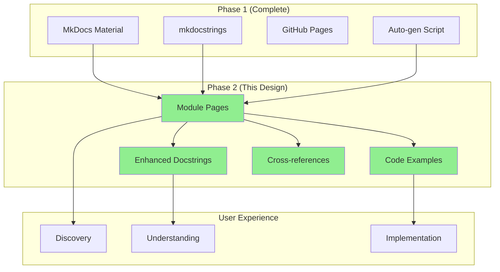

# Design: Complete API Documentation (Phase 2)

## Architecture Overview

This design document details the technical implementation of comprehensive API documentation for sleap-roots, building on the MkDocs infrastructure from Phase 1.

## System Context



## Directory Structure

### Current State
```
docs/
├── api/
│   └── index.md          # 456 lines, all API docs inline
├── getting-started/
├── tutorials/
└── guides/
```

### Target State
```
docs/
├── api/
│   ├── index.md          # Overview + navigation hub
│   ├── core/
│   │   ├── series.md     # Series class documentation
│   │   └── pipelines.md  # All 7 pipeline classes
│   ├── traits/
│   │   ├── lengths.md    # Length calculations
│   │   ├── angles.md     # Angle calculations
│   │   ├── tips.md       # Tip detection
│   │   ├── bases.md      # Base detection
│   │   ├── convhull.md   # Convex hull analysis
│   │   ├── ellipse.md    # Ellipse fitting
│   │   ├── networklength.md  # Network metrics
│   │   ├── scanline.md   # Scanline analysis
│   │   └── points.md     # Point utilities
│   ├── utilities/
│   │   └── summary.md    # Summary statistics
│   └── examples/
│       └── common-workflows.md  # Multi-module examples
├── getting-started/
├── tutorials/
└── guides/
```

## Module Page Design

### Template Structure

Each module page follows this consistent structure:

```markdown
# [Module Name]

## Overview

[2-3 paragraph description]
- What this module does
- When to use it
- Key concepts

## Quick Example

```python
# Minimal working example
import sleap_roots as sr
[2-5 lines showing basic usage]
```

## API Reference

### [function_name]

::: sleap_roots.module.function_name
    options:
      show_source: true
      members: false
      show_root_heading: true

**Parameters**:
[Additional explanation if needed beyond docstring]

**Returns**:
[Additional explanation if needed]

**Example**:
```python
# Realistic example with context
import sleap_roots as sr
import numpy as np

# Setup realistic data
pts = np.array([[10.5, 20.3], [15.2, 25.1], [20.8, 30.5]])

# Usage
result = sr.function_name(pts, param=value)
print(result)
# Output: [expected output]
```

**Common Pitfalls**:
- Issue 1: How to avoid
- Issue 2: How to handle

**See Also**:
- [related_function](#related-function)
- [other_module](../path/to/module.md)

---

[Repeat for each function]

## Advanced Usage

[Optional section for complex scenarios]

## Related Modules

- **[module_name](../module.md)** - Brief relationship description
```

### mkdocstrings Configuration

Using existing configuration from `mkdocs.yml`:

```yaml
plugins:
  - mkdocstrings:
      handlers:
        python:
          paths: [.]
          options:
            docstring_style: google
            docstring_section_style: table
            show_root_heading: true
            show_root_full_path: false
            show_source: true
            show_bases: true
            members_order: source
            heading_level: 2
            merge_init_into_class: true
            separate_signature: true
            show_signature_annotations: true
            signature_crossrefs: true
```

**Rendering**:
- `::: sleap_roots.module.function` → mkdocstrings auto-generates
- Pulls from Google-style docstrings
- Shows source code links
- Type annotations rendered as links

## Navigation Updates

### mkdocs.yml Changes

```yaml
nav:
  - Home: index.md
  - Getting Started: [...]
  - Tutorials: [...]
  - User Guide: [...]
  - API Reference:
      - Overview: api/index.md
      - Core:
          - Series: api/core/series.md
          - Pipelines: api/core/pipelines.md
      - Trait Computation:
          - Lengths: api/traits/lengths.md
          - Angles: api/traits/angles.md
          - Tips: api/traits/tips.md
          - Bases: api/traits/bases.md
          - Convex Hull: api/traits/convhull.md
          - Ellipse: api/traits/ellipse.md
          - Network Metrics: api/traits/networklength.md
          - Scanline: api/traits/scanline.md
          - Points: api/traits/points.md
      - Utilities:
          - Summary: api/utilities/summary.md
      - Examples:
          - Common Workflows: api/examples/common-workflows.md
  - Developer Guide: [...]
  - Cookbook: [...]
  - Changelog: changelog.md
```

### Updated API Index

Refactor `docs/api/index.md` from inline docs to navigation hub:

```markdown
# API Reference

Welcome to the sleap-roots API reference. Choose a category below:

## 🏗️ Core

Essential classes for loading and processing data:

- **[Series](core/series.md)** - Load SLEAP predictions and access root points
- **[Pipelines](core/pipelines.md)** - Pre-built trait computation workflows

## 📊 Trait Computation

Calculate specific traits from root data:

### Geometry & Morphology
- **[Lengths](traits/lengths.md)** - Root length measurements
- **[Angles](traits/angles.md)** - Root angle calculations
- **[Tips](traits/tips.md)** - Tip point detection
- **[Bases](traits/bases.md)** - Base point detection and width

### Spatial Analysis
- **[Convex Hull](traits/convhull.md)** - Convex hull features
- **[Ellipse](traits/ellipse.md)** - Ellipse fitting
- **[Network Metrics](traits/networklength.md)** - Whole-plant network analysis
- **[Scanline](traits/scanline.md)** - Horizontal scanline intersections

### Utilities
- **[Points](traits/points.md)** - Point manipulation and filtering

## 🔧 Utilities

- **[Summary](utilities/summary.md)** - Summary statistics and export

## 📚 Examples

- **[Common Workflows](examples/common-workflows.md)** - End-to-end examples

## Quick Links

- [Installation Guide](../getting-started/installation.md)
- [Quick Start Tutorial](../getting-started/quickstart.md)
- [Pipeline Decision Tree](../guides/index.md)
```

## Code Example Strategy

### Example Data Sources

**Option 1: Use Test Fixtures** (Recommended)
```python
# Reference actual test data
from sleap_roots import Series

# Use canola test data
series = Series.load(
    "canola_test",
    h5_path="tests/data/canola_h5/frame0000.h5",
    primary_path="tests/data/canola_slp/primary_multi_day.slp",
    lateral_path="tests/data/canola_slp/lateral_multi_day.slp"
)
```

**Pros**:
- Real data users can actually run
- Matches test suite
- Validates examples work

**Cons**:
- Requires Git LFS
- Examples more verbose

**Option 2: Synthetic Minimal** (For Some Cases)
```python
# Quick synthetic example
import numpy as np
pts = np.array([[10, 20], [15, 25], [20, 30]])
```

**Pros**:
- Self-contained
- Easy to understand
- No dependencies

**Cons**:
- Not realistic
- Doesn't show real workflow

**Decision**: Use **Option 1 for workflow examples**, **Option 2 for function-specific examples**

### Example Testing Strategy

To ensure examples don't break:

1. **Manual testing** during creation
2. **Doctest** for simple inline examples
3. **Future**: pytest-examples or mkdocs-jupyter for automated testing

Not implementing automated example testing in Phase 2 (add in future phase).

## Docstring Enhancement

### Audit Process

For each module:

1. **Read all public functions**
2. **Check for required sections**:
   - Summary line ✓
   - Args with types ✓
   - Returns with type and description ✓
   - Raises (if applicable) ✓
3. **Identify gaps**
4. **Enhance minimally** - only where truly needed

### Enhancement Principles

**DO**:
- ✅ Add missing Args/Returns descriptions
- ✅ Clarify ambiguous descriptions
- ✅ Add examples to complex functions
- ✅ Document edge cases (NaN, empty arrays)

**DON'T**:
- ❌ Rewrite working docstrings
- ❌ Change established terminology
- ❌ Break existing auto-generation
- ❌ Add unnecessary verbosity

### Example Enhancement

**Before** (hypothetical - actual docstrings may be fine):
```python
def get_root_angle(pts, n_points=5):
    """Get the angle of a root.

    Args:
        pts: Points array
        n_points: Number of points

    Returns:
        Angle value
    """
```

**After**:
```python
def get_root_angle(pts, n_points=5):
    """Calculate the root angle relative to gravity (vertical).

    Measures the angle of the root's proximal segment (first n_points)
    relative to the vertical axis, with 0° = straight down, 90° = horizontal.

    Args:
        pts: Root points as (instances, nodes, 2) array, where last dimension
            is (x, y) coordinates
        n_points: Number of proximal points to use for angle calculation.
            Default 5 points provides stable angle estimate.

    Returns:
        Angle in degrees [0, 180], where 0° is vertical downward and
        180° is vertical upward. Returns NaN if insufficient valid points.

    Example:
        >>> pts = np.array([[10, 20], [11, 25], [12, 30], [13, 35], [14, 40]])
        >>> angle = get_root_angle(pts, n_points=5)
        >>> print(f"{angle:.1f}°")
        11.3°

    See Also:
        get_vector_angle_from_gravity: Core angle calculation
        get_node_ind: Point selection for angle computation
    """
```

**Changes**:
- Clarified what "angle" means (relative to gravity)
- Explained coordinate system
- Detailed return value range and meaning
- Added edge case (NaN)
- Provided example
- Added cross-references

## Cross-Reference System

### Internal Links

**Function to function** (same module):
```markdown
**See Also**: [related_function](#related-function)
```

**Function to different module**:
```markdown
**See Also**: [module.function](../traits/module.md#function)
```

**Module to module**:
```markdown
## Related Modules

- **[lengths](lengths.md)** - For computing root lengths after angle analysis
- **[points](points.md)** - For filtering points before angle calculation
```

### External Links

**To tutorials**:
```markdown
**See Also**: [DicotPipeline Tutorial](../../tutorials/dicot-pipeline.md)
```

**To user guides**:
```markdown
**See Also**: [Data Formats Guide](../../guides/data-formats/sleap-files.md)
```

## Build & Deployment

### Local Testing

```bash
# Serve locally
uv run mkdocs serve

# Strict build (fail on warnings)
uv run mkdocs build --strict
```

### CI Integration

Already configured in `.github/workflows/docs.yml`:
- Builds on all PRs
- Deploys to GitHub Pages on main
- Strict mode catches broken links

### Quality Checks

Before merging:
- [ ] `mkdocs build --strict` passes
- [ ] All internal links work
- [ ] Examples are tested manually
- [ ] Navigation structure correct
- [ ] No broken auto-generation

## Performance Considerations

### Build Time

- mkdocstrings introspection adds ~5-10 seconds per module
- Total build time: ~2-3 minutes (acceptable)
- No optimization needed for 13 modules

### Page Load Time

- Each module page ~50-100 KB
- Material theme lazy-loads navigation
- Fast enough for GitHub Pages

## Accessibility

- Semantic HTML from Material theme
- Code blocks have proper language tags
- Alt text for any diagrams (if added)
- Keyboard navigation works

## Future Enhancements (Not Phase 2)

### Automated Example Testing
```python
# pytest-examples or mkdocs-jupyter
# Test all code blocks automatically
```

### Interactive Examples
```python
# Jupyter widgets in docs
# Pyodide for browser-based execution
```

### API Diff Tool
```python
# Show API changes between versions
# Highlight breaking changes
```

### Automatic Cross-Reference Generation
```python
# Parse function calls to auto-generate "See Also"
# Network graph of module dependencies
```

## Migration Strategy

### Preserving Existing Content

`docs/api/index.md` currently has inline API references:

**Approach**:
1. Extract each module's content from index.md
2. Create dedicated module page
3. Replace inline content with link in index.md
4. Keep index.md as navigation hub

**Rollback Plan**:
- Keep old index.md as index.md.bak temporarily
- If issues, can revert quickly
- Delete backup after successful deploy

## Success Metrics

### Quantitative
- 13 module pages created
- 100% of public functions have examples
- 0 mkdocs build warnings
- <5 minutes build time

### Qualitative
- New user can find relevant function quickly
- Examples are copy/paste-able and work
- Cross-references aid discovery
- Documentation feels cohesive

---

**Design Status**: ✅ Complete and ready for implementation